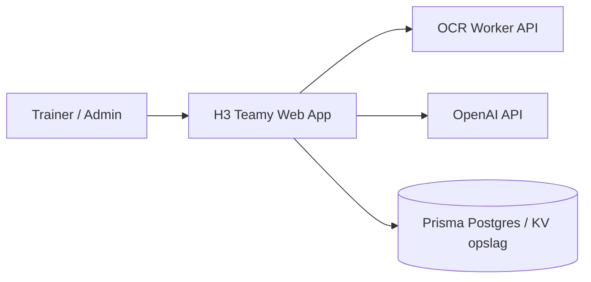
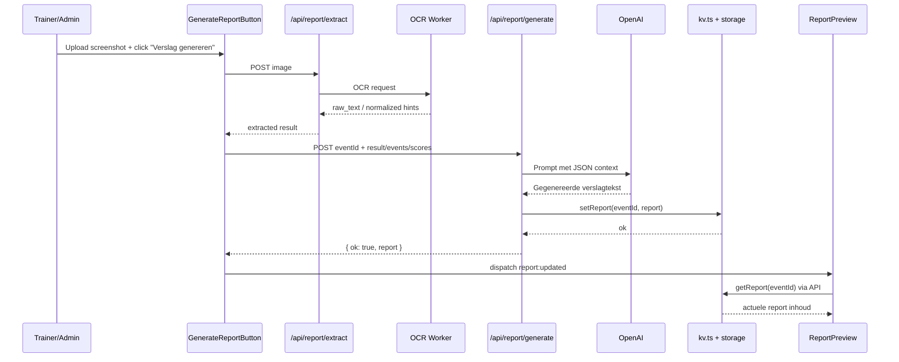

# C4 Model - Match Report Flow

Dit document beschrijft de flow voor het maken van een wedstrijdverslag in C4-stijl.

## 1) System Context (C4 Level 1)



- **Actor**: Trainer/Admin start het genereren van een verslag.
- **System**: H3 Teamy Next.js applicatie.
- **Externe systemen**: OCR worker, OpenAI, opslag (DB/KV).

## 2) Container Diagram (C4 Level 2)

```mermaid
flowchart LR
  U[Trainer/Admin]

  subgraph SYS[H3 Teamy System]
    subgraph NEXT[Container: Next.js Web App]
      UI[UI Layer\npages + components]
      API[API Layer\n/api/report/extract\n/api/report/generate\n/api/report]
      SVC[Service/Domain Layer\nnormalizers + narrative prep + kv helpers]
      EXS[Extract Provider Service\nREPORT_EXTRACT_PROVIDER: vlm|ocr|hybrid]
    end

    DB[(Container: Data Store\nPrisma Postgres + KV fallback)]
  end

  OCR[Container: OCR Worker API\nEasyOCR service]
  LLM[Container: OpenAI API\nvision extraction + report generation]

  U -->|HTTPS| UI
  UI -->|HTTPS/JSON| API
  API -->|in-process calls| SVC
  API -->|in-process calls| EXS
  SVC -->|SQL / KV operations| DB
  EXS -->|HTTPS multipart| OCR
  EXS -->|HTTPS JSON + image| LLM
  API -->|HTTPS JSON narrative prompt| LLM
```

### Containers

| Container                | Technology                    | Responsibility                                                                    |
| ------------------------ | ----------------------------- | --------------------------------------------------------------------------------- |
| Next.js Web App          | Next.js / TypeScript          | UI + API endpoints voor extract/generate/report                                   |
| Data Store               | Prisma Postgres + KV fallback | Opslaan en ophalen van rapporten en gerelateerde metadata                         |
| Extract Provider Service | TypeScript service module     | Runtime provider switch voor image extract (`vlm`, `ocr`, `hybrid`)               |
| OCR Worker API           | FastAPI + EasyOCR             | Extractie van tekst uit geuploade wedstrijdfoto's                                 |
| OpenAI API               | OpenAI Chat/Responses APIs    | Vision extractie en genereren van narratieve verslagtekst op basis van JSON input |

## 3) Component Diagram (C4 Level 3)

```mermaid
flowchart LR
  A[GenerateReportButton.tsx] --> B[/api/report/extract]
  B --> C[OCR Worker]
  A --> D[/api/report/generate]
  D --> E[normalizers/type guards in route.ts]
  E --> F[prepareNarrativeInput()]
  F --> G[OpenAI Responses API]
  D --> H[getReport()/setReport() in kv.ts]
  H --> I[(Storage)]
  A --> J[window event report:updated]
  J --> K[ReportPreview / report page refresh]
```

Belangrijkste componenten:

- `src/components/GenerateReportButton.tsx`
- `src/app/api/report/extract/route.ts`
- `src/app/api/report/generate/route.ts`
- `src/app/api/report/route.ts`
- `src/lib/kv.ts`

## 4) Dynamic Flow (C4 Level 4 - Sequence)



## Scope / Notities

- Dit model dekt het pad "verslag genereren" (extract + generate + opslaan + tonen).
- MVP sluit/heropen flow is verwant maar buiten scope van dit document.
