# GTA H3 — 3D mode

## Summary

A second, optional renderer over the unchanged 2D simulation (spec:
`docs/superpowers/specs/2026-09-26-arena-3d-mode-design.md`). The player can switch between a
top-down 2D view and a third- or first-person 3D view of the same match at any time; every other
client keeps seeing whatever mode it is in. Nothing about the simulation, netcode or scoring
differs between the two — 3D is presentation only, built from the same `Scene` the 2D renderer
already draws.

Shipped alongside 3D: networked destructible buildings (sim-side health, collapse and rebuild,
rendered as ruins in both 2D and 3D), a rocket launcher, and 3D-only guidance (navigation ribbon,
mission beacons, player markers, a zone wall). Protocol version is **5** (4 added structures and
the rocket; 5 adds aiming down the sights to the input frame).

## Screenshots

Captured in the dev build (Wageningen, dusk):

|                                                                                   |                                                                                  |
| --------------------------------------------------------------------------------- | -------------------------------------------------------------------------------- |
|  |  |
|         |       |

The same ruins in the 2D view: 

First person at the wheel and on foot with the Uzi (see [Cockpit](#cockpit) and
[Shots leave the weapon](#shots-leave-the-weapon)):

|                                                                                                         |                                                                                              |
| ------------------------------------------------------------------------------------------------------- | -------------------------------------------------------------------------------------------- |
| 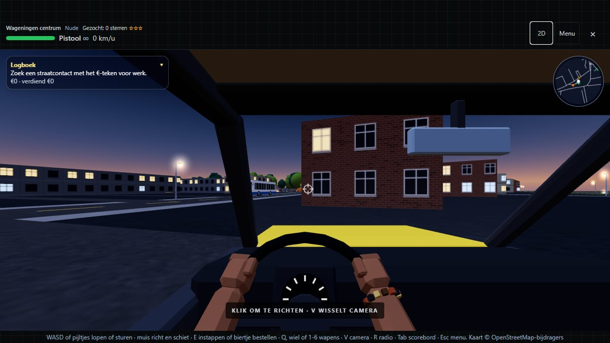 | 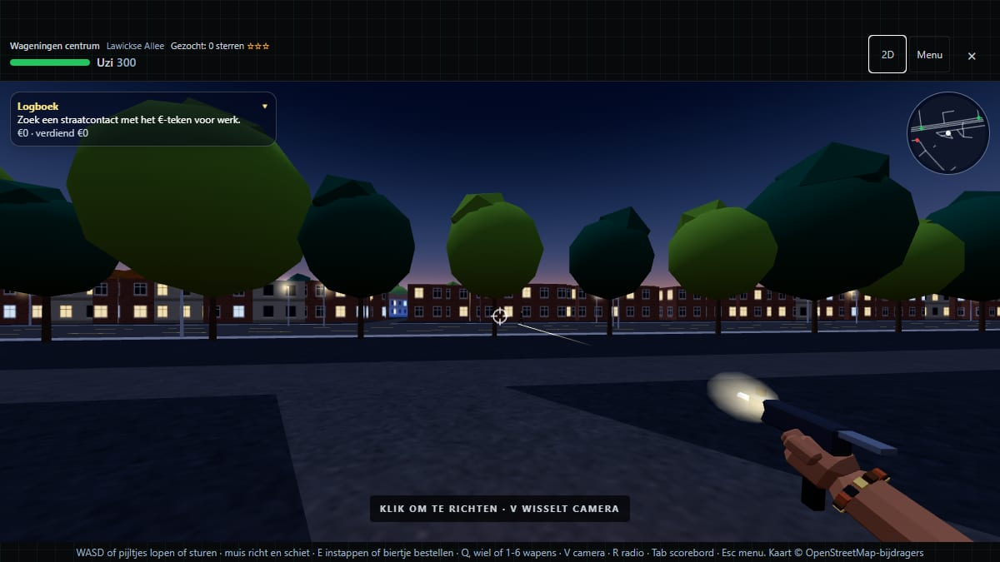 |

The glTF cast (see [Characters: the glTF cast](#characters-the-gltf-cast)):

|                                                                                       |                                                                                              |
| ------------------------------------------------------------------------------------- | -------------------------------------------------------------------------------------------- |
| 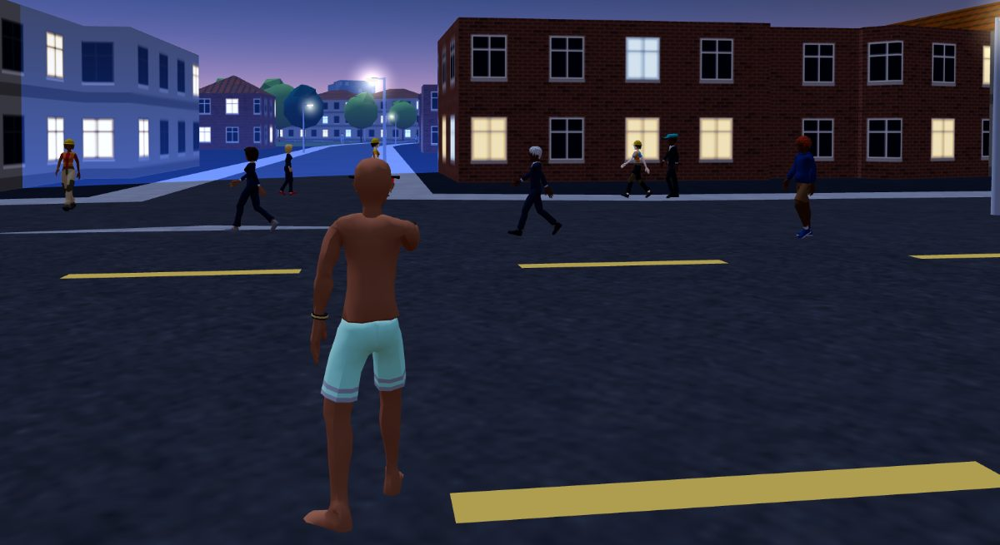 | 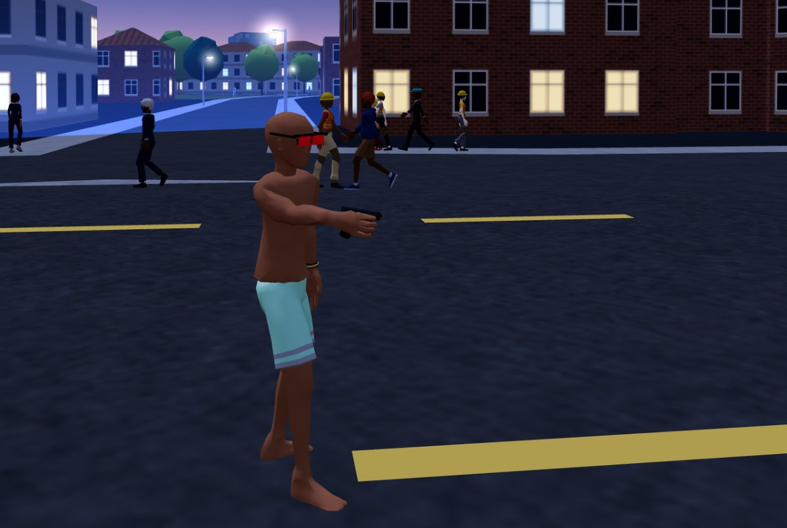 |

The Kenney cars (see [Cars: the Kenney Car Kit](#cars-the-kenney-car-kit)):

|                                                                                                   |                                                                                            |
| ------------------------------------------------------------------------------------------------- | ------------------------------------------------------------------------------------------ |
| 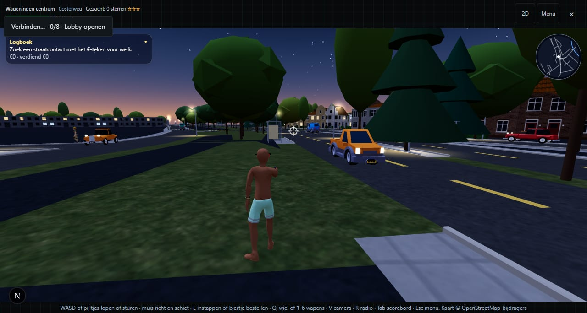 | 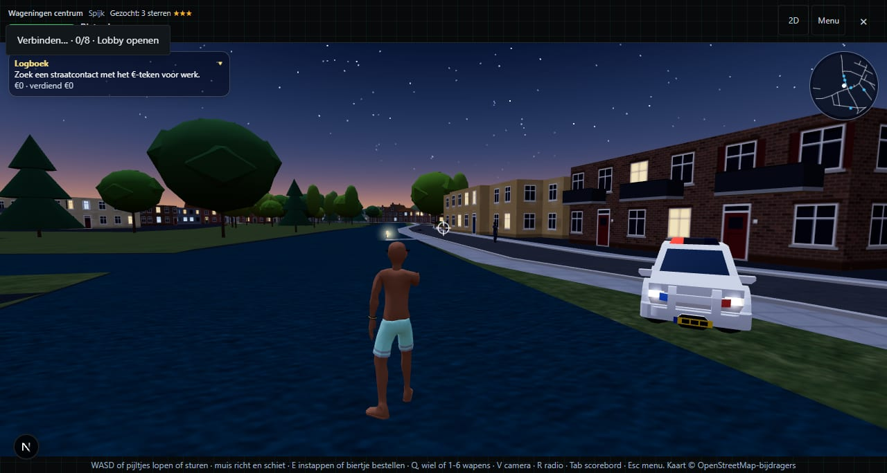 |
| 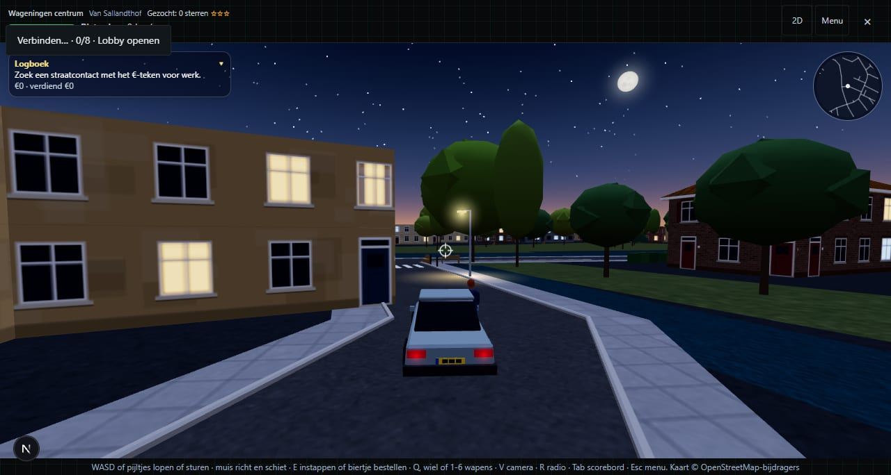                  | 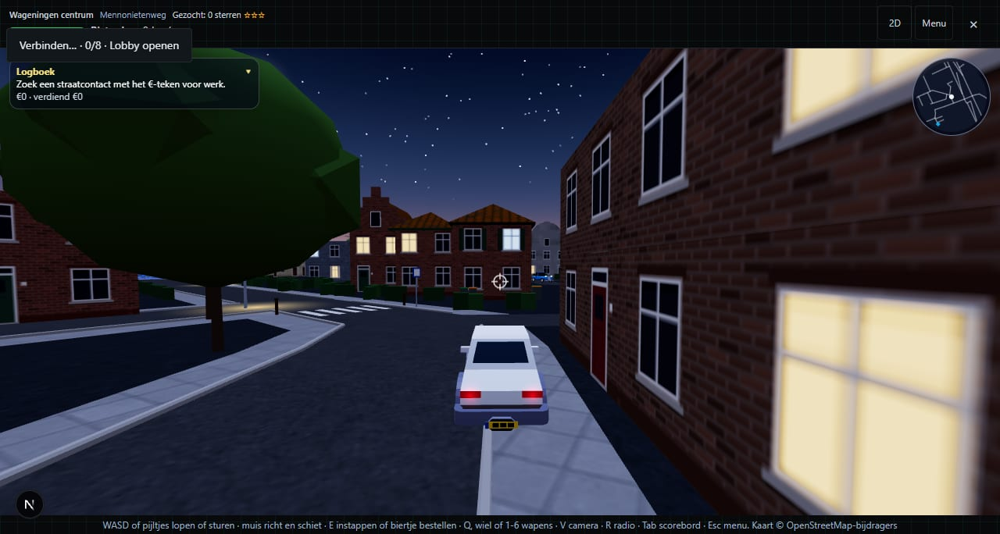                    |

Every Kit kind, procedural above and Kit below, and the rounded bus, oldtimer and tank (before,
after):

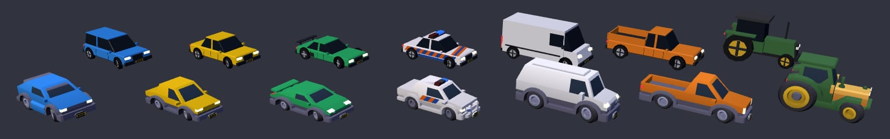

| 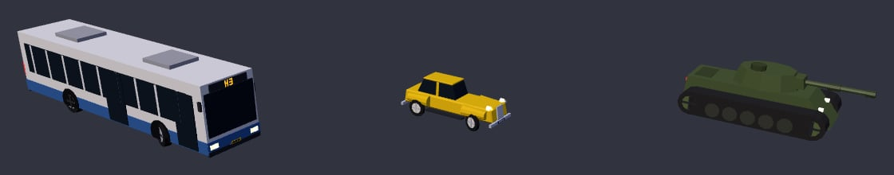 | 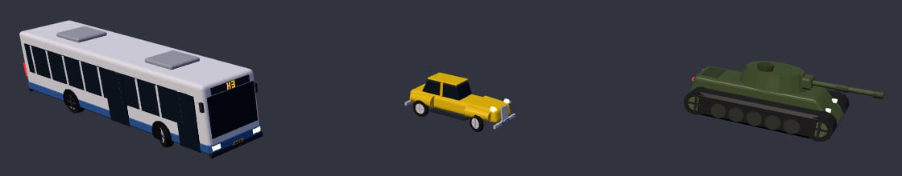 |
| ------------------------------------------------------------ | ----------------------------------------------- |

## Architecture

### A second renderer, not a replacement

The 2D renderer (`src/lib/cityArena/render/`) keeps running exactly as before; 3D
(`src/lib/cityArena/render3d/`) is an alternative way to draw the same per-frame `Scene` — players,
peds, cops, vehicles, bullets, effects, structures — that `arenaRuntime.ts` builds every frame
regardless of which view is active. Switching modes never touches the simulation, the network
client or the HUD state; it only changes which renderer reads that frame's `Scene`.

### Dynamic import

`src/lib/cityArena/render3d/index.ts` is the 3D view's only public entry point:

> Everything outside `render3d/` and `components/cityArena/view3d/` may import from here with
> `import type` only.

`src/components/cityArena/view3d/useView3d.ts` loads the whole module with one dynamic
`import("@/lib/cityArena/render3d")`, the first time a player switches to 3D — so three.js and
every render3d file stay out of the 2D game's bundle for players who never open 3D. Before that
download it asks a throwaway canvas for a WebGL2 context (`hasWebGl2` in
`src/lib/cityArena/webgl2.ts`, which loses the probe's context straight away), so a device without
WebGL2 never fetches three.js; `createView3d` still throws `WebGl2UnavailableError` if the real
canvas refuses. Either way the hook shows "3D werkt niet op dit apparaat" for 4 seconds and falls
back to 2D, and the failure is a Sentry breadcrumb, not an exception (AGENTS.md's Sentry-noise
policy — no WebGL2 is expected on some devices). The same goes for the render3d chunk failing to
download — a `ChunkLoadError` from a tab still on the previous deploy, or a dropped connection
(`isChunkLoadError` in `src/lib/cityArena/chunkLoadError.ts`). Any other failure while starting or
rendering 3D goes to Sentry as a real error and also falls back to 2D.

When the view is disposed (back to 2D, a new boot, leaving the game) it frees the module-level
geometries and materials that characters, vehicles, pickups and weapons share
(`disposeSharedAssets` in `render3d/sharedAssets.ts`) before the renderer, so toggling 2D↔3D does
not keep old renderers reachable through three.js's dispose listeners; the next view rebuilds them.

### Canvas stacking

The 3D view renders into its own WebGL `<canvas>`, created fresh on every mount
(`mountView3d` in `useView3d.ts`) and stacked **under** the existing 2D canvas inside
`View3dLayer` (`components/cityArena/view3d/View3dLayers.tsx`). In 3D mode the 2D canvas is
cleared every frame and repainted as a transparent HUD layer (crosshair, off-screen friend arrows,
the click-to-aim hint, the failure toast) by `render3d/overlay3d.ts`; it keeps every pointer, wheel
and touch event, so none of the existing 2D input bindings move. The WebGL layer itself has
`pointer-events: none`. Split screen and the TV screen (`/arena/scherm`) stay 2D — see Known
limitations.

### Module map: `src/lib/cityArena/render3d/`

Grouped by responsibility; every exported symbol carries its own JSDoc.

**Entry point, renderer and shared plumbing**

| File              | Responsibility                                                                                                     |
| ----------------- | ------------------------------------------------------------------------------------------------------------------ |
| `index.ts`        | `createView3d(canvas)`: wires every layer together, places the camera, drives one frame                            |
| `renderer3d.ts`   | WebGL renderer, three.js scene, camera, evening lights, fog; `RenderQuality`, view distance and pixel-ratio tables |
| `cameraRig.ts`    | Third-person and first-person rigs (the driver's eye per vehicle kind), pitch limits, car chase and death orbit    |
| `cameraFeel.ts`   | The 2D feedback's screen shake (`SHAKE_METRES_PER_PX`) and drunk sway, as a camera nudge and roll                  |
| `sharedAssets.ts` | `disposeSharedAssets`: frees the module-level character (procedural and glTF), vehicle, pickup and weapon caches   |
| `coords.ts`       | The one world ↔ three.js mapping (`(x, y)` metres → `(x, height, y)`) and angle helpers                            |
| `idHash.ts`       | Deterministic per-id "randomness" (façade choice, tree size/turn) so every device builds the same town             |
| `disposal.ts`     | `disposeObject`: frees geometries, materials and textures of a whole `Object3D` subtree                            |
| `meshBuffers.ts`  | Growable vertex/index buffers the city builders fill, turned into one indexed `BufferGeometry`                     |
| `lowPoly.ts`      | Bevelled/tapered block and faceted-rod primitives, vertex-coloured and flat-shaded                                 |
| `footprint.ts`    | Footprint measurements (centre, longest edge) shared by roofs, landmark dressing and ruins                         |
| `testing/`        | Test doubles for render3d's own suite (`gltfFixture.ts` / `carFixture.ts`: in-code glTF characters, cars)          |

**The streamed city**

| File                  | Responsibility                                                                                                                                                                           |
| --------------------- | ---------------------------------------------------------------------------------------------------------------------------------------------------------------------------------------- |
| `city3d.ts`           | Owns the shared `WorldMaterials` and the streamed cells; rebuilds a cell when a landmark lookup changes                                                                                  |
| `cellGrid.ts`         | The 128 m cell grid, counted from the world origin                                                                                                                                       |
| `worldCells.ts`       | Streams cells around the camera under a time budget, drops far ones, rebuilds a cell when a building in it falls, rebuilds or its tile arrives, scorches damaged buildings               |
| `buildCell.ts`        | One cell's merged geometry from the decoded map tiles: ground, roads, buildings, trees, furniture; at full detail also street paint, kerbs, clutter, bikes and lamp pools                |
| `worldMaterials.ts`   | The materials every cell shares (never owned or disposed per cell)                                                                                                                       |
| `textures.ts`         | Loads the 2D surface art as repeating textures; the façade wall colours per finish                                                                                                       |
| `sky.ts`              | The evening sky dome, fog-matched at the horizon; shows the stars and moon at full detail                                                                                                |
| `roadMesh.ts`         | Road ribbons, centre-line markings, street lamps along the pavements (moved out past cycle paths at full detail)                                                                         |
| `buildingMesh.ts`     | Walls (one façade-atlas draw per cell) and roofs by the 2D map's own tile-vs-gravel rule; at full detail gables, shopfronts, balconies, awnings and roof detail from the building's plan |
| `pitchedRoof.ts`      | A ridge-and-gable roof for non-rectangular footprints (churches, pools)                                                                                                                  |
| `treeMesh.ts`         | Instanced trunks and canopies: two greens at basic detail; at full detail three species, sized, turned and tinted per tree                                                               |
| `furnitureMesh.ts`    | Instanced lamps/benches/bus shelters with a pose proxy for cosmetic knock-over; a pool of light under each lamp at full detail                                                           |
| `landmarkDressing.ts` | Per-landmark silhouettes (church spire, pool glass hall, campus glass, café awning, brewery chimney)                                                                                     |

**City detail** (full detail at "auto" and "hoog"; see [City detail](#city-detail))

| File                                                    | Responsibility                                                                                                                                                                                                           |
| ------------------------------------------------------- | ------------------------------------------------------------------------------------------------------------------------------------------------------------------------------------------------------------------------ |
| `cityDetail.ts`                                         | `CityDetail` (`basic` / `full`) and `cityDetailFor(quality)`: "laag" builds basic, "auto" and "hoog" full                                                                                                                |
| `cellContext.ts`                                        | A cell's surroundings within 48 m, bucketed: nearest road, on-carriageway, ground kind and footprint questions for the detail builders                                                                                   |
| `bucketGrid.ts`                                         | The plain bucket grid `cellContext.ts` and `tileIndex.ts` are built on                                                                                                                                                   |
| `tileIndex.ts`                                          | A per-tile bucket index of buildings, roads and ground, made once per tile, so a cell never scans a whole 2 km tile                                                                                                      |
| `detailBuffers.ts`                                      | Vertex-coloured quads and oriented boxes, merged into a cell's one detail mesh                                                                                                                                           |
| `facadeSheets.ts`                                       | The twelve façade colourways (brick, plaster, panel, concrete, glass) and which one a building wears, by id and block                                                                                                    |
| `facadeAtlas.ts`                                        | Paints every colourway's window, ground-floor and plain modules plus the shopfronts into one atlas; the patched material that wraps UVs inside each block                                                                |
| `facadePaint.ts` / `facadeWalls.ts` / `facadeGround.ts` | The atlas's painters: windows (lit warm or cold, curtains), wall textures and plinths, doors and eight shopfronts with sign boards                                                                                       |
| `wallQuads.ts`                                          | Wall quads at storey height: the basic layout, and the detailed one with windows centred on each wall and shop bays on the ground floor                                                                                  |
| `facadePlan.ts`                                         | A building's plan by id: colourway, shop walls, gable, balconies, chimney, dormer, fascia                                                                                                                                |
| `gableHouse.ts`                                         | Stepped and bell gables on narrow terraced houses, with their pitched roofs                                                                                                                                              |
| `roofDetail.ts`                                         | Roof faces with a 25 cm overhang, fascia boards, chimneys, dormers                                                                                                                                                       |
| `facadeExtras.ts`                                       | Balconies on flats and awnings over shopfronts                                                                                                                                                                           |
| `streetMarkings.ts`                                     | Kerbs (cut back at side streets), red cycle paths, zebra crossings, sign sites and grass verges                                                                                                                          |
| `streetClutter.ts` / `clutterShapes.ts`                 | Where clutter goes (shops, houses, gardens, flats, zebras; at most 150 pieces a cell, never on a carriageway, cycle path or footprint) and its shapes: bikes, racks, bins, containers, bollards, signs, planters, hedges |
| `treeSpecies.ts`                                        | Broadleaf, poplar and conifer: each tree's species by id and the unit crowns, darker underneath                                                                                                                          |
| `skyDetail.ts`                                          | The seeded star field and the moon disc with its halo                                                                                                                                                                    |
| `lampPools.ts`                                          | Additive pools of lamplight on the street, fading to black in the fog, out for a fallen lamp                                                                                                                             |

**Characters and vehicles**

| File                                         | Responsibility                                                                                            |
| -------------------------------------------- | --------------------------------------------------------------------------------------------------------- |
| `characters.ts`                              | The character factory (glTF cast, procedural fallback, LOD) and the procedural person                     |
| `characterAssets.ts`                         | Lazily loaded glTF cast: manifest, models, rig clips split per layer                                      |
| `characterAppearance.ts`                     | Pure: look + id → model, palette colours, hidden slots, scale, accessories                                |
| `characterAnimation.ts`                      | Pure: pose → clip weights and gait pace (`clipMix`)                                                       |
| `gltfCharacter.ts` / `gltfAnimator.ts`       | A glTF `Character3d` and its layered `AnimationMixer`                                                     |
| `characterPalette.ts`                        | The palette-slot Lambert material the glTF cast draws with                                                |
| `characterAccessories.ts`                    | Accessories on the glTF cast's bones (cap, glasses, shades, bracelet, backpack, badge)                    |
| `characterRig.ts`                            | The shared 17-bone rig and per-look merged geometry                                                       |
| `characterPose.ts`                           | Pure procedural poses: idle, walk/run (phased by distance), aim, death                                    |
| `characterLooks.ts`                          | The cast's looks, translated from the 2D sprites' sampled colours                                         |
| `characterParts.ts`                          | Body/face/hair as rigid low-poly parts bound to one bone each                                             |
| `characterExtras.ts`                         | Accessories (shades, caps, hoods, backpack, hi-vis) layered over a look                                   |
| `vehicles3d.ts`                              | A live vehicle (wheel roll, brake lamps, light bar, turret, wreck look) and the Kit-or-procedural factory |
| `vehicleModels.ts`                           | `buildVehicleModel`: the Kit model once loaded, else a procedural body mesh + wheels + flares             |
| `vehicleLooks.ts`                            | What both builders share: each kind's height, `bodyColour`, the light-bar lens materials                  |
| `carAssets.ts`                               | Lazily loaded Kenney Car Kit: manifest and one file per kind                                              |
| `gltfVehicle.ts`                             | A `VehicleModel` from a Kit model: shared scaled body, tinted paint, round wheels, lamps, plates          |
| `vehicleParts.ts`                            | Shared material cache and primitive shapes vehicles are cut from (bevelled or rounded slabs)              |
| `vehicleShapes.ts` / `vehicleShapesHeavy.ts` | Per-kind shape builders (passenger kinds; bus/tractor/tank)                                               |
| `vehicleTrim.ts`                             | Wheel arches, door shut lines and Dutch number plates (yellow; classic blue on the oldtimer)              |
| `vehicleLamps.ts`                            | Head and tail lamps as lamps: the tail lamps' running/brake glow and one additive flare per lamp          |
| `vehicleSmoke.ts`                            | Wreck column smoke and bonnet smoke below the 2D `smokeHealthOf` threshold                                |

**Weapons, view model and projectiles**

| File                  | Responsibility                                                                                                  |
| --------------------- | --------------------------------------------------------------------------------------------------------------- |
| `weapons3d.ts`        | Small procedural weapon models, shared between a character's hand and first person                              |
| `viewmodel.ts`        | First-person forearms/fists: stride bob, shot kick, punch/swing, weapon-change dip; the barrel tip in the world |
| `viewModelPass.ts`    | Draws the hands — or, at the wheel, the cockpit — in a pass of its own (near-clipped camera) over the city      |
| `cockpitSpecs.ts`     | `COCKPITS`: every vehicle kind's driver's eye, wheel, dashboard, windscreen, bonnet and frame, in car space     |
| `cockpitParts.ts`     | Pure builders of a kind's cockpit geometry: interior shell, bonnet paint, wheel, dial, glass, siren strips      |
| `cockpit3d.ts`        | A live cockpit: per-kind cached geometry, the wheel turning in both hands, speedometer needle, siren glow       |
| `muzzleMap.ts`        | The frame's muzzle point per shooter id (players, officers, a tank's barrel), pooled                            |
| `muzzleBlend.ts`      | `CONVERGE_M` and the maths that draws a round out of its muzzle onto the flat line                              |
| `projectiles3d.ts`    | Pooled rockets and cannon shells (by bullet id), trails laid by distance flown, launched from the muzzle        |
| `projectileModels.ts` | Shared rocket and shell geometry/materials                                                                      |
| `tracers.ts`          | One shared `LineSegments` draw call for every gun round in flight, drawn out of its shooter's muzzle            |

**Pickups, effects and destruction**

| File                                   | Responsibility                                                                              |
| -------------------------------------- | ------------------------------------------------------------------------------------------- |
| `pickups3d.ts`                         | Spinning/bobbing item models over an additive glow disc, hidden once taken                  |
| `effects3d.ts`                         | Owns the fire/smoke particle budgets and the debris pool; syncs bursts per effect id        |
| `particles.ts` / `particleMaterial.ts` | Pooled `Points` particle systems and their procedural soft-sprite shader                    |
| `debris.ts`                            | Tumbling low-poly chunks in one `InstancedMesh`                                             |
| `fxEmit.ts`                            | Data-driven puff/chunk specs plus seeded emitters                                           |
| `flashes.ts` / `fireballMaterial.ts`   | Muzzle flashes and explosion fireballs, a pooled `PointLight` set                           |
| `glowMaterial.ts`                      | Shared additive glow shader (beacons, pickups, lamp heads)                                  |
| `destruction3d.ts`                     | Collapse stand-in, rubble mounds (`RUBBLE_COLOUR`), furniture knock-over                    |
| `ruinGeometry.ts`                      | Footprint prism and jittered rubble-mound geometry                                          |
| `ruins3d.ts`                           | Finds new collapses by diffing the frame's destroyed-structure ids against the last frame's |
| `knockOver3d.ts`                       | Knocks furniture over near fast cars and fresh explosions                                   |
| `toppling.ts`                          | The generic 90°-tip animation `destruction3d.ts` and `knockOver3d.ts` share                 |

**Guidance, cast and HUD**

| File                 | Responsibility                                                                        |
| -------------------- | ------------------------------------------------------------------------------------- |
| `cast3d.ts`          | One frame step: entity sync, mission contacts, hands or cockpit, effects, destruction |
| `entities.ts`        | Per-frame pooled sync of players/peds/cops/cars/pickups; your car and every muzzle    |
| `entityPool.ts`      | Recycles scene objects per entity id through free lists keyed by look/vehicle variant |
| `entityMotion.ts`    | Infers walk speed, gait phase and wheel turn between frames (pure, allocation-free)   |
| `entityShots.ts`     | Who fired this frame, for character recoil and the view model                         |
| `guidance3d.ts`      | Owns the route, beacons, zone wall and player markers layers                          |
| `route3d.ts`         | The glowing navigation band along the route, rebuilt only when the route changes      |
| `beacons3d.ts`       | Pulsing light columns over mission contacts/objectives, readable from far away        |
| `contacts3d.ts`      | Mission contacts as idle characters, dressed by a hash of their id                    |
| `zoneWall3d.ts`      | The match zone's edge as a wall of light, built only near the player                  |
| `playerMarkers3d.ts` | A camera-facing diamond over every other living player                                |
| `playerArrows.ts`    | Edge-of-screen arrows toward friends who are out of view                              |
| `missionMarkers.ts`  | Pure read of the scene's mission contacts/objectives for `guidance3d`/`contacts3d`    |
| `overlay3d.ts`       | The 2D HUD canvas overlay: crosshair and off-screen arrows                            |

## City detail

The immersion pass (plan `docs/superpowers/plans/2026-09-27-arena-immersion-4-city-detail.md`)
turned the blocky first city into a Dutch evening town. The detail comes in two levels, picked by
the render quality (`cityDetail.ts`): **"laag" builds `basic`**, exactly the first city's geometry
(a snapshot test holds every basic cell of the fixture town to the first city's vertex counts),
and **"auto" and "hoog" build `full`**. Changing quality marks every cell stale; they rebuild
nearest first under the usual budget.

What `full` adds:

- **Façades.** One canvas atlas holds twelve Dutch colourways — red, brown, yellow and grey
  brick, five plasters, panels, concrete, glass — each with upper-storey window modules (lit warm
  or cold, some with curtains), a ground floor with doors, and eight shopfronts with sign boards
  and goods in lit windows. Each wall vertex carries its atlas block, and a patched Lambert shader
  wraps the UVs inside it, so every wall of a cell is one draw call (at "laag" too). Windows are
  centred on each wall. Per building id, `facadePlan.ts` picks shopfronts on walls facing a busy
  road, stepped or bell gables on narrow terraced houses, balconies on flats, awnings, chimneys,
  dormers and fascia boards under a 25 cm roof overhang.
- **Streets.** Bevelled kerbs (cut back where a side street joins), red cycle paths on primary and
  secondary roads (lamps move out past them), zebra crossings by junctions with give-way, zone and
  crossing signs, and grass verges where the map leaves a strip between road and field.
- **Street clutter.** Bike racks in front of shops, bikes against house walls, wheelie bins with
  coloured lids, containers by flats, bollards, planters and clipped hedges along front gardens —
  at most 150 pieces a cell, never on a carriageway, cycle path or footprint. All of it merges
  into the cell's one vertex-coloured detail mesh; the bikes are one instanced mesh, tinted per bike.
- **Trees.** Broadleaf (62 %), poplar (20 %) or conifer (18 %) by tree id, ±20 % in size, turned
  and tinted from each species' evening greens, crowns darker underneath.
- **Sky and lamplight.** 1500 seeded stars fading into the horizon glow, and the moon on the
  moonlight's bearing at 22° up (the light itself shines from 64°, so the streets stay lit); a
  soft additive pool of light on the street under every lamp, fading to black in the fog and out
  when the lamp is knocked over.
- **Vehicles** (every quality). Bevelled bodies, dark wheel arches, door lines, darker glass and
  Dutch plates; head and tail lamps with a flare that only shows from in front of its lamp; tail
  lamps that brighten while the car slows faster than coasting (`watchBrakes` measures the
  deceleration over the time since the speed last changed, so a frame rate above the simulation's
  30 Hz never fakes a stop); a wreck's lamps go dark. Since the aim round, seven kinds draw the
  Kenney Car Kit's models instead (see [Cars: the Kenney Car Kit](#cars-the-kenney-car-kit)),
  keeping all of this.

Everything is seeded by map ids (`idHash.ts`), so every device builds the same town, and all of it
is presentation only: no simulation, collision or wire change.

| Before ("auto", first city)                                        | After ("auto", full detail)                                                                                |
| ------------------------------------------------------------------ | ---------------------------------------------------------------------------------------------------------- |
| 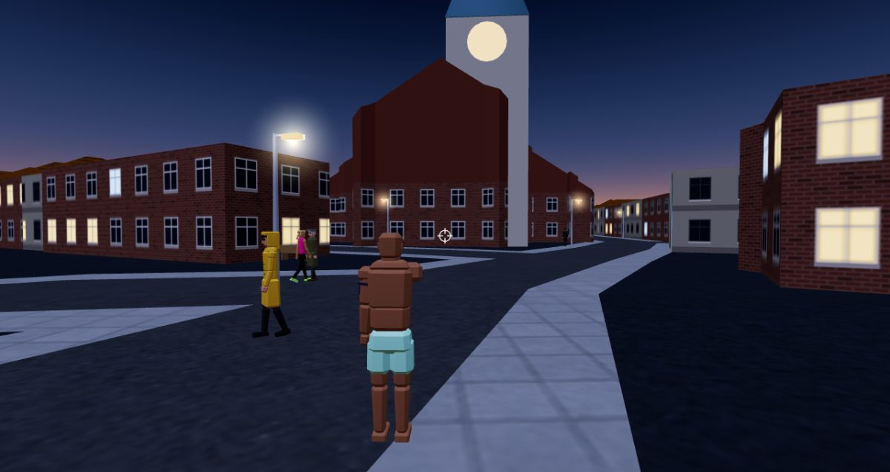  | 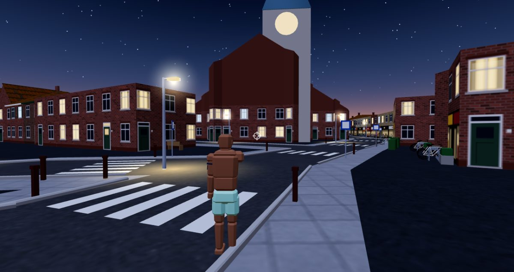 |
| 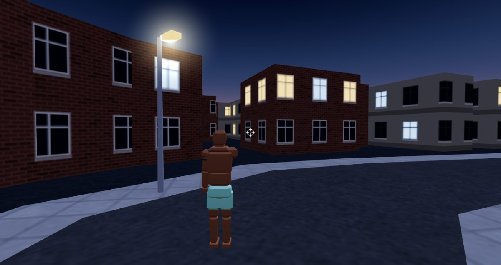   | 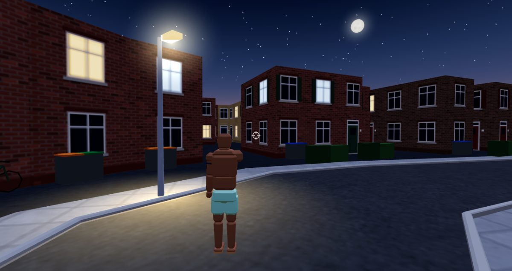           |
| 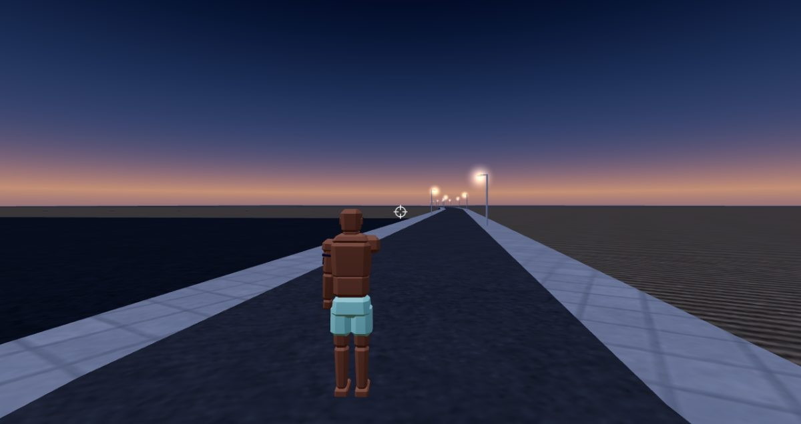 | 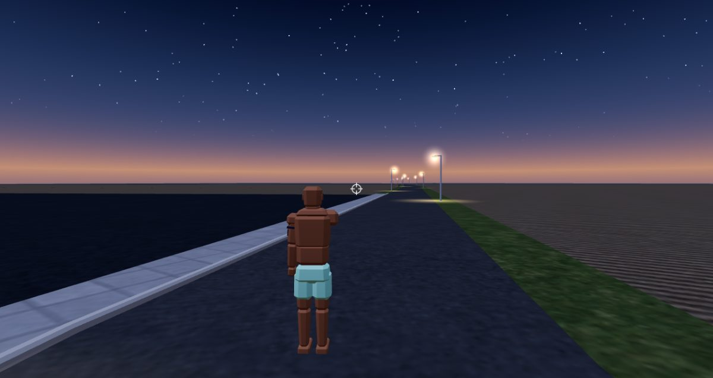                             |
| 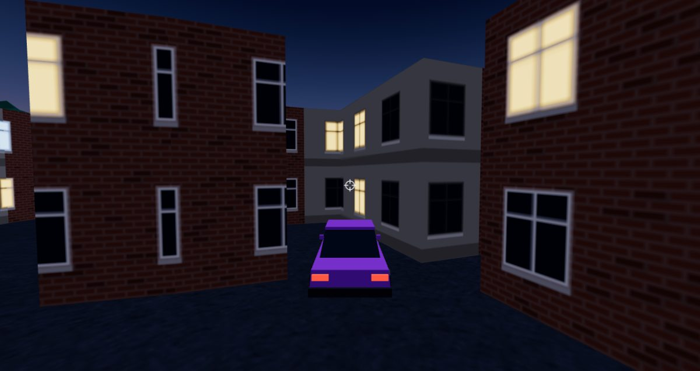                        | 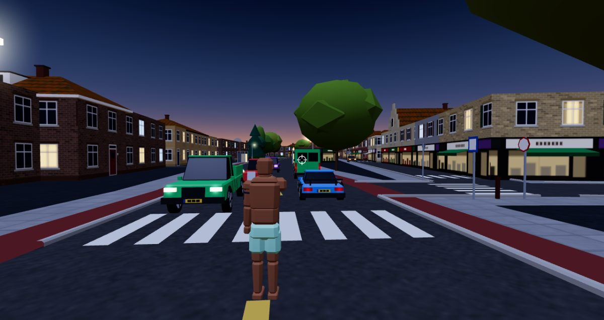                      |

|                                                                            |                                                                                   |
| -------------------------------------------------------------------------- | --------------------------------------------------------------------------------- |
| 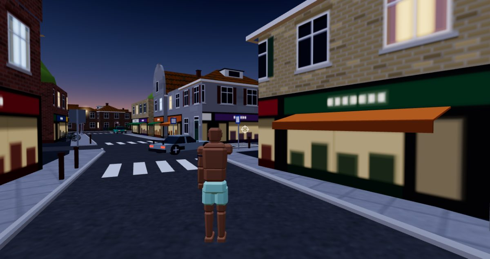  | 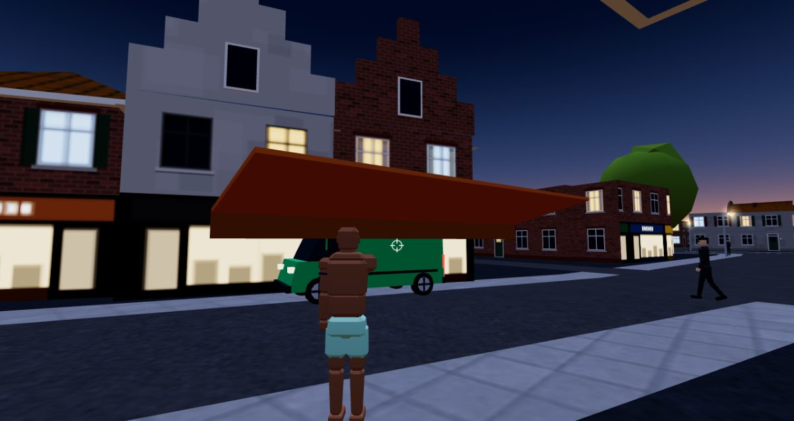 |
| 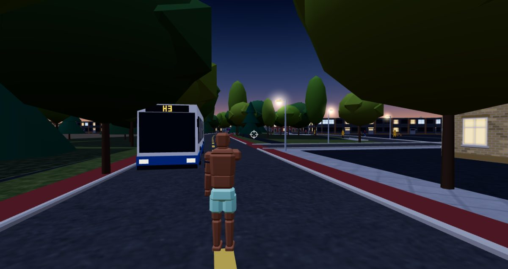 | 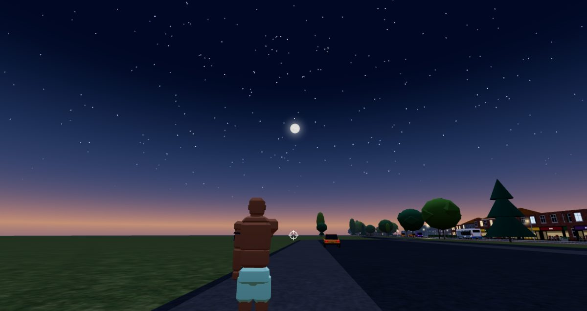                       |

### Measured cost

Browser: dev build, 1280 × 678 canvas at device pixel ratio 1, median of three runs per spot;
"city" is the frame with every person and vehicle removed, and the milliseconds are JavaScript
plus GPU per frame (with `gl.finish`) on a shared, noisy dev machine. Spots: A Rhenen by the
Cunerakerk, B a Wageningen residential street, C a road through the fields.

| Spot | Quality | City draw calls, before → after | City frame, ms before → after |
| ---- | ------- | ------------------------------- | ----------------------------- |
| A    | auto    | 236 → 225                       | 1.13 → 1.98                   |
| B    | auto    | 242 → 238                       | 1.17 → 1.18                   |
| C    | auto    | 64 → 74                         | 0.40 → 0.54                   |
| A    | laag    | 175 → 131                       | 0.95 → 0.79                   |
| B    | laag    | 162 → 114                       | 0.73 → 0.62                   |
| C    | laag    | 44 → 44                         | 0.29 → 0.35                   |

With the cast at A: 284 → 292 calls and 2.86 → 3.18 ms at "auto", 230 → 193 calls and
3.15 → 2.53 ms at "laag". The façade atlas (every wall of a cell in one call) pays for the
detail, paint, bike, crown and pool meshes, so "auto" stays within the plan's +30 % draw-call
budget (−5 %, −2 %, +16 %) and "laag" draws a quarter fewer calls than before. Each vehicle
draws one call more than before (its lamp flares): 9–11.

Cell builds (Node, not jsdom; all cells within 380 m, second of two passes; same machine and
load for both rows; mean / p90 / max ms):

| Spot         | basic (first city's geometry) | full            |
| ------------ | ----------------------------- | --------------- |
| A (41 cells) | 0.88 / 1.8 / 2.8              | 3.3 / 8.4 / 13  |
| B (39 cells) | 1.05 / 1.7 / 1.9              | 4.8 / 7.7 / 9.2 |
| C (42 cells) | 0.20 / 0.3 / 1.3              | 0.3 / 0.6 / 1.1 |

A typical full cell costs about one `WORLD_BUILD_BUDGET_MS` (4 ms); the densest town-centre
cells take two to three, so streaming one in makes that frame longer (see Known limitations).

## Characters: the glTF cast

Spec: `docs/superpowers/specs/2026-09-27-arena-immersion-design.md` §7. The people in the street
are Quaternius' low-poly characters ("Ultimate Modular Men/Women", 15 models from Poly Pizza, CC0
and two CC-BY 3.0 — see `public/arena/characters/CREDITS.md`), animated, and every pedestrian is
dressed differently — deterministically from its id, so every device shows the same crowd and
nothing new goes on the wire. The procedural characters (`characters.ts` and the `character*`
modules) stay as the fallback.

### Pipeline: `npm run arena:pack-characters`

`scripts/arena/pack-characters.ts` (pure half and tests: `packCharacters.ts`) downloads each
owner-approved GLB once into `.cache/arena/characters/` (gitignored), pinned by URL and sha256 —
a file whose hash moved is refused — and writes `public/arena/characters/`:

- **One file per model** (`<key>.glb`): the four body-part meshes joined into **one skinned
  primitive**; every material becomes a **palette slot** — each vertex carries its former
  material's slot in a `_PALETTE` byte attribute and the file has one white material. A material
  that colours the head or feet _and_ another part gets a slot of its own there (`Head/Red`,
  `Feet/Black`), so hair and shoes recolour apart from clothes. Normals, UVs and vertex colours are
  dropped (the vertices then weld to about a quarter), joints become bytes and weights normalised
  bytes (core glTF, no extensions), animations and the hooded adventurer's sword are removed.
- **One animation file per rig** (`anim-men.glb`, `anim-women.glb`): every man shares one
  skeleton and every woman the other (same 62 bone names, different proportions and timing), so
  the eight clips the game plays are kept once per rig from `casual-man` and `woman-a`, without
  the channels that only hold the rest pose.
- **`manifest.json`** (schema `CharacterManifestSchema` in `src/lib/cityArena/characterManifest.ts`,
  shared by the script and the view): per model its file, rig, gender, slot names, original
  colours (sRGB) and bind-pose height; per rig its file and the clip playing each role.
- **`CREDITS.md`**: one row per file (title, author, licence, page).

`--probe` prints each source's meshes, materials, bones and clips instead. Findings: 62 bones
(`Root Body Hips Abdomen Torso Chest Neck Head`, `Shoulder/UpperArm/LowerArm/Wrist` and five
fingers per side, `UpperLeg/LowerLeg/Foot` and an IK pole `PT` per side); 4–11 flat-colour
materials per model, no textures; 24 clips per rig (`Idle`, `Walk`, `Run`, `Death`,
`Punch_Right`, `Idle_Gun_Pointing`, `Gun_Shoot`, `Sword_Slash` are kept). Packed: 2.3 MB for all
17 files (models 121–166 KB each, animations 136/143 KB); the budget is 3 MB.

`npm run arena:check-characters` (CI verify job, next to `arena:check-audio`) checks that every
manifest file exists, no stray `.glb` sits beside them, the set stays within 3 MB and every file
has exactly one credits row.

### Runtime

| Module                    | Responsibility                                                                                          |
| ------------------------- | ------------------------------------------------------------------------------------------------------- |
| `characterAssets.ts`      | Loads the manifest and files lazily with `GLTFLoader`, rebuilds creased normals, splits clips per layer |
| `characterAppearance.ts`  | Pure: look + id → model, colour per palette slot, hidden slots, scale 0.92–1.08, accessories            |
| `characterAnimation.ts`   | Pure: `PoseInput` → clip weights (`clipMix`), gait pace from each rig's measured stride                 |
| `gltfCharacter.ts`        | `Character3d` over a `SkeletonUtils` clone: palette material, animator, weapon slot, re-dressing        |
| `gltfAnimator.ts`         | Layers the clips on an `AnimationMixer`: legs, upper body, one-off clips, death; eased weights          |
| `characterPalette.ts`     | The Lambert material that colours each vertex from its slot (one program, one table per character)      |
| `characterAccessories.ts` | Cap, glasses, the player's red shades and bead bracelet, backpack, badge — rigid meshes on bones        |

- **Loading and fallback.** The first character asked for starts the download
  (`requestCharacterAssets`). Until it lands — and for the rest of the session if it fails — the
  factory builds procedural characters. A network failure is a Sentry breadcrumb
  (`isBenignTransientClientFetchError`); a missing or broken file is `captureException` with
  `area: characters`. When the cast arrives, each entity's pool **variant** (its glTF model, or
  its look for a procedural one) no longer matches, so the entity sync re-claims it once, keeping
  its motion and shot memory. `disposeSharedAssets` frees the cast with the other shared assets.
- **Pooling.** glTF characters are pooled per model (`gltf:<key>`) and **re-dressed** for their
  next owner (`EntityFactories.dressCharacter`): palette, scale and accessories change, the
  animator resets. Ids come from the entity (players, peds, cops) or a hash of a mission
  contact's id (`contactSeed`).
- **Appearance.** Pedestrians get a model from the 14 city models, one of eight skin tones, hair
  (black, browns, blond, red, grey), tops, bottoms and shoes from curated palettes, a scale and up
  to two accessories. Colours **replace** the model's own per slot (`MODEL_SLOT_ROLES` maps each
  model's slots to skin, hair, top, bottom, shoes…). The **player** is the beach model, bald (the
  hair slot is hidden: its triangles are sent past the far plane), shirtless, in mint shorts,
  barefoot, with red-lensed shades and the bead bracelet. **Other players** are a hoodie man or a
  woman in a top of their vest hue. **Officers** are the SWAT model in police navy with a gold
  badge.
- **Animation.** Idle, walk and run cross-fade by speed; the walk and run advance on one shared
  gait phase at `speed / stride` cycles per second (strides measured from the clips: men 1.84 m /
  2.37 m per cycle, women 1.78 m / 2.39 m), so the feet stay planted through the blend. Aiming a
  gun raises it with the upper body only (the legs keep the gait); a fresh recoil plays
  `Gun_Shoot`, `Punch_Right` or `Sword_Slash` once on the upper body; death plays once and holds
  its last frame (a character first seen dead lies down at once). Weights ease over about 0.2 s.
  The model faces +Z and is turned to the game's +X; it is scaled to its look's height (women
  0.95 of it).
- **Weapons.** The procedural weapon models hang from the `WristR` bone, barrel along the fingers
  (the bat leaves the fist like a sword); `muzzleWorld` reads the barrel tip as for the procedural
  characters.
- **Level of detail and cost.** At "laag", characters beyond `GLTF_LOD_DISTANCE_M` = 45 m (with
  10 % slack before turning back) stay procedural. Characters beyond `FULL_RATE_ANIMATION_M` =
  40 m advance their mixer every other frame with both frames' time; hidden characters (your own
  body in first person) do not advance at all. Each glTF character is one draw call (plus one per
  accessory), about 6 000 triangles against 1 600 for a procedural one. Measured on the dev
  machine (Node, no GPU), 40 walking characters cost about 3 ms of CPU a frame (mixers, bone
  matrices, skeleton upload data) against 0.2 ms procedural, about 1.9 ms when all are far.

## Cars: the Kenney Car Kit

Spec: `docs/superpowers/specs/2026-09-28-arena-aim-drive-cars-design.md` §3, §8. The owner found
the slab-built cars too blocky; seven kinds now draw models from Kenney's
[Car Kit](https://kenney.nl/assets/car-kit) (version 3.1, CC0 — see
`public/arena/cars/CREDITS.md`), scaled to the simulation's footprint. The bus, the oldtimer and
the tank have no Kit counterpart and keep procedural bodies, now rounded.

### Pipeline: `npm run arena:pack-cars`

`scripts/arena/pack-cars.ts` (pure halves and tests: `packCars.ts`, `carSources.ts`,
`carGeometry.ts`, `carBody.ts`, `carMeasure.ts`, `carAtlas.ts`, `zip.ts`) downloads the one owner-approved archive once into
`.cache/arena/cars/` (gitignored), pinned by URL and sha256 — an archive whose hash moved is
refused — reads it with a dependency-free zip reader, and writes `public/arena/cars/`:

- **One file per kind** (`<kind>.glb`, 35–51 KB, 277 KB together; budget 1.5 MB): the model turned
  into the game's frame (x forward, y up, z to the right; the Kit's is x left, z forward) and
  recentred on its footprint on the ground. The Kit's one texture — a 16 × 4 atlas of flat and
  gradient swatches — is **baked into vertex colours**, so the files carry no texture. The body's
  triangles are split into primitives by role, each role a material of that name: **paint** (the
  kind's body swatches; its vertex colours hold the swatch's shading as a grey the view multiplies
  the car's colour by), **detail** (everything else in its own colours, the window glass darkened
  to `CAR_GLASS`, the Kit's number-plate faces recessed to trim), **head** and **tail** (the
  yellow and red lamp swatches within 30 % of the length from their end), and on the police car
  **lens-left** / **lens-right** (its roof lamps). Each wheel is its own node, centred for
  spinning. Normals and UVs go; dedup merges the wheels on one side, never the role materials.
- **`manifest.json`** (schema `CarManifestSchema` in `src/lib/cityArena/carManifest.ts`, shared by
  the script and the view): per kind its file, source model, size, the Kit's own paint colour,
  each wheel (middle, radius, width, whether it steers), each lamp's face, each plate's face and
  height, and on the police car the flat door panel between the arches for the livery.
- **`CREDITS.md`**: one row per file.

`--probe` lists every model in the Kit instead. Findings: every car is a `body` node plus four
separate wheel nodes (`wheel-front-left` …), the left and right wheels mirror images; one material
`colormap` over a 512 × 512 PNG atlas outside the GLBs (gltf-transform's `readBinary` refuses
that, so the pack reads their JSON and buffer with the atlas as a resource); about 700 body
triangles and 332–428 per wheel. The kind mapping:

| Kind      | Kit model          | Paint swatches             | Notes                                                      |
| --------- | ------------------ | -------------------------- | ---------------------------------------------------------- |
| `compact` | `hatchback-sports` | green                      |                                                            |
| `sedan`   | `sedan`            | red                        |                                                            |
| `sport`   | `sedan-sports`     | red                        | with its spoiler                                           |
| `police`  | `police`           | light grey and blue-grey   | white all over (the Kit's is black-and-white); roof lenses |
| `van`     | `van`              | blue                       | the Kit's one-box van, not its box-bodied `delivery`       |
| `pickup`  | `truck`            | green                      | the Kit's pickup                                           |
| `tractor` | `tractor`          | blue-grey (its whole body) | yellow rims; four lamps added (the Kit's tractor has none) |

`npm run arena:check-cars` (CI verify job, next to `arena:check-characters`; both run the shared
`packAudit.ts`) checks that every manifest file exists, no stray `.glb` sits beside them, the set
stays within 1.5 MB and every file has exactly one credits row.

### Runtime

| Module            | Responsibility                                                                                  |
| ----------------- | ----------------------------------------------------------------------------------------------- |
| `carAssets.ts`    | Loads the manifest and every kind's file lazily with `GLTFLoader`; fails once, stays procedural |
| `gltfVehicle.ts`  | `buildGltfVehicleModel`: a `VehicleModel` from a kind's asset, its geometry built once per kind |
| `vehicleLooks.ts` | Heights, `bodyColour` and the lens materials, shared by the Kit and the procedural builders     |
| `vehicles3d.ts`   | `createVehicleFactory`: the Kit model once loaded, the procedural one before and for the others |

- **Loading and fallback.** The first vehicle asked for starts the download
  (`requestCarAssets`). Until it lands — and for the rest of the session if it fails — every
  vehicle is procedural. A network failure is a Sentry breadcrumb
  (`isBenignTransientClientFetchError`); a missing or broken file is `captureException` with
  `area: cars`. When the Kit arrives, each car's pool **variant** changes from `<kind>:<colour>` to
  `gltf:<kind>:<colour>` (interned, so asking every frame allocates nothing), and the entity sync
  swaps it once, keeping its steering memory. `disposeSharedAssets` frees the Kit and the geometry
  built from it.
- **Scale.** A kind's body is stretched to `lengthOf × widthOf` and its `VEHICLE_HEIGHT_M`
  (the Kit's cars are stubby: a sedan by 1.65 along, 1.2 across, 1.12 up). The wheels stay round:
  they grow by the height's scale, across by the width's, sit at the stretched axle positions and
  touch the ground.
- **Materials.** The body is one mesh with four draw groups in a fixed order: the paint
  (`shadedPaintMaterial(bodyColour(kind, colour))`, one per colour, vertex shading kept), the
  shared vertex-coloured detail, the headlamp glow and the tail lamps' running glow — the slot
  `rigLamps` finds, so braking lights them exactly as on a procedural car. Flares sit at the
  manifest's lamp faces. Our yellow Dutch plates (`addPlateAt`) stand on the Kit's plate recesses,
  and on the police car a band of orange and blue stripes (`addPoliceStripes`) runs along the door
  panel; both merge into the detail group. The police car's roof lamps are its light-bar lenses
  and flash blue then red as before. A wreck swaps every material for the char.
- **Sharing.** The stretched body, wheel and lens geometries are built once per kind and shared by
  every car of it (`VehicleModel.shared`); a car owns only its mesh objects, material array and
  flares, so freeing it leaves the kind's geometry alone.
- **Cost.** Each car draws in exactly as many calls as its procedural model — 9 (the police car
  11: two lenses) — with about 2 100–2 500 triangles against 700–1 550 (the Kit's tyres and rims
  are 332–428 triangles a wheel). The whole set is 277 KB to download.

### The rounder bus, oldtimer and tank

`slab` can now round a part's edges and corners (`round`: three's `RoundedBoxGeometry` with two
facets a quarter turn, welded so it merges with the other parts). The bus has a rounded body (its
destination board and windscreen moved clear of the rounded roof edge) and bevelled skirt and
roof units; the oldtimer a rounded body and glass house and sixteen-sided wings; the tank a
rounded hull over its glacis, bevelled tracks and mantlet, and more sides on its turret (18), road
wheels, gun and hatch. Footprints and heights are unchanged; vertices grow by 1.2–1.5×.

## Input

### Camera-relative movement

`src/lib/cityArena/input/cameraInput.ts` (`cameraRelativeInput`) rotates the simulation's raw
`WorldInput.move` into the camera's frame before it reaches the (unchanged) simulation: on foot,
and for an analog stick in a car, "forward" always means "along the camera", while a keyboard
driving a car keeps its tank steering (W gas, A/D steer) untouched. The flat sim's `aim` angle is
replaced by the camera's own look yaw, since 3D gives the player no 2D canvas point to aim at.
`src/lib/cityArena/input/cameraYaw.ts` supplies the camera's own motion besides the mouse: the
third-person chase eases behind the car after `CHASE_IDLE_S` = 1.2 s of a resting mouse, the
driver's seat is bolted to the car and only offset by the mouse, and — with no aim stick held — a
lone movement stick slowly turns the camera toward the walking direction so a touch player without
a second stick can still look around, until the touch look pad has turned the camera (see
[Touch](#touch)); from then on the camera is the player's to turn.

### Mouse-look and the lock-free fallback

`src/lib/cityArena/input/mouseLook.ts` (`attachMouseLook`) binds to the 2D canvas: a primary click
requests the browser's pointer lock, and while locked, pointer movement turns yaw/pitch at
`MOUSE_SENSITIVITY_RAD_PER_PX` = 0.0024 rad/px. Pointer lock is refused in some embedded browsers
and sandboxed frames (`requestPointerLock()` rejecting is expected, not a bug) — that refusal is a
Sentry breadcrumb, and mouse-look falls back to **lock-free** mode: plain `pointermove` events over
the canvas turn the camera without any button held, and every click still retries the real lock.
`View3dLayer` shows "Klik om te richten · V wisselt camera" on a fine (mouse) pointer until the
player has either locked the pointer or triggered the lock-free fallback.

When anything modal opens over the playfield — the menu, the map or a mission offer —
`CityArenaOverlay` calls `MouseLook.release()` (through `useReleaseLockWhile` and the view's
`release` control): it exits the pointer lock **without** the lock-lost callback, so the mouse can
reach the dialog's buttons and no pause menu opens over it. The next click on the playfield takes
the lock again. While a mission offer is open the trigger is held off (`holdFireDuringOffer` in
`arenaRuntime.ts`), so a click or pad press meant for "Aannemen" never fires behind it — movement
and the accept command itself still flow.

### V — camera toggle

`KeyV` (`src/lib/cityArena/input/keyboard.ts`, `TOGGLE_CAMERA_KEY`) switches between third and
first person. Pitch is clamped per mode (`pitchLimitsFor` in `cameraRig.ts`): roughly −35°…+40° in
third person, ±30° in first person; `useView3d` re-applies the limits whenever the mode changes.

### Touch

2D, split screen and the TV controller keep their controls (the twin-stick or single-stick layouts
of `docs/tech/arena/README.md`, Plan 6). In 3D on a touch device the right-hand side changes, so
that turning to look never pulls the trigger (aim round §6):

- **Look pad** (`components/cityArena/TouchLookPad.tsx`, `input/touchLook.ts`): the right 55 % of
  the playfield, where the aim stick sits in 2D, under the buttons and the radar. One finger at a
  time — a second finger is ignored — and a drag turns the camera at `TOUCH_LOOK_RAD_PER_PX` =
  0.008 rad/px times **Kijkgevoeligheid** (`touchLookSensitivity`, 0,25–2,5×, default 1; a slider
  under Besturing in the menu on touch devices). Dragging right turns right, up looks up. It never
  fires. The turn adds up between frames and `view3d/touchLook3d.ts` takes it once per frame: the
  yaw goes onto mouse-look's (so the chase camera counts it as a look and waits before easing
  behind the car), the pitch is a tilt on top of mouse-look's inside the mode's range
  (`TouchCamera`, whose range `useView3d` updates with the camera mode).
- **Schieten**: a big round button in the bottom-right corner, under the thumb. Held, it fires (the
  `buttons` source of `fire`); a drag that starts on it also feeds the look pad, and the pointer is
  captured, so one thumb can keep firing while it tracks a target and may wander off the button.
- **Richten** (scope icon, pressed while up): toggles the `buttons` source of the foundation's
  `ads` button. It goes down, and is disabled, with the fist or the bat, on the death screen and
  while the menu, the map or a mission offer is open; it also goes down when the page is hidden
  (the input is cleared then). On a short screen (≤ 480 px tall, a phone held sideways) it sits
  beside Schieten instead of above it, clear of the radar.
- Wapen, Instappen/Uitstappen and (in a car) Radio stay, to the left of that pair. In a car the
  left stick steers as before, the pad turns the camera and Schieten drive-bys.
- **Aim assist** (`input/aimAssist.ts`, touch only): while the crosshair is within
  `ASSIST_CONE_RAD` (2°) of a living target's body — other players, officers and pedestrians within
  `ASSIST_RANGE_M` (60 m); never yourself and never a car, so never your own — the pad's turn is
  multiplied by `ASSIST_FRICTION` (0.45). No auto-rotate, no auto-fire, and the mouse is never
  slowed. The look is measured from the player's (or car's) eye along the camera's yaw and pitch;
  the over-the-shoulder camera's half-metre offset is a few degrees at close range, which the
  target's own width absorbs.
- A first-run tip explains the layout ("… rechts slepen om rond te kijken · houd Schieten vast om
  te schieten · Richten zoomt in"), stored under `h3-arena-touch3d-tip-v1` apart from the 2D tip,
  and the footer hint names the look pad and Schieten.
- A stick surface that unmounts mid-drag lets go of its stick, so the 2D aim stick cannot stay
  aiming and firing when 3D takes over under the thumb.

|                                                                                            |                                                                                                              |
| ------------------------------------------------------------------------------------------ | ------------------------------------------------------------------------------------------------------------ |
| 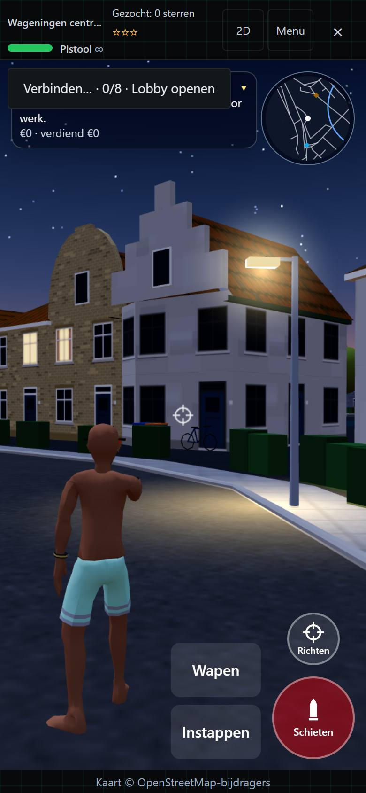 | 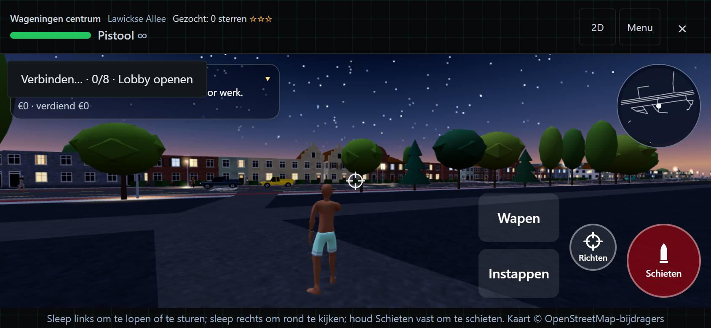 |

## Cockpit

In first person at the wheel you look out of the car from the driver's seat (immersion spec
`docs/superpowers/specs/2026-09-27-arena-immersion-design.md` §4):

- **Seat.** `cockpitSpecs.ts` holds one `CockpitSpec` per vehicle kind (`COCKPITS`), in car space
  (+X forward, +Y up, +Z right, origin at the footprint centre on the ground): the driver's eye
  (height, along the car, left of the centre line — Dutch cars put the wheel on the left), the
  wheel (radius, reach, drop, tilt), the dashboard, the windscreen (foot, header, pillars, rake),
  the bonnet (length, width, height, fall to the nose) and where the cab ends behind the eye. The
  numbers are read off the exterior models (`vehicleShapes*.ts`). `cameraRig.ts` seats the
  first-person camera at the kind's eye (`seatOffset`) instead of one fixed seat: a bus or tractor
  driver sits high, a sports car driver low. Mouse-look and the ±30° pitch limit are unchanged.
- **Your car hides for you.** `entities.ts` hides the local player's own car body in first person
  while it is whole (a wreck shows again, and the death camera takes over when you die); everyone
  else keeps seeing it. It also hands the cast the car's kind, paint, steering (the same `trackSteer`
  the front wheels use), speed, pose and siren as `local.vehicle`.
- **Drawn in the view-model pass.** `viewModelPass.ts` draws the cockpit instead of the hands, in the
  same small lit scene seen through a camera that copies the city camera but clips at 1 cm, after
  the city with the depth buffer cleared — so the dashboard never clips into a wall and the car
  never pokes through. The cockpit stands where the car stands (`headingToRotationY(heading)`),
  which lines up with the world because the pass camera sits exactly where the city camera does;
  the pass's far plane is 8 m, past a car's nose.
- **The model** (`cockpitParts.ts`, `cockpit3d.ts`): a dashboard sloping down to the windscreen, a
  lit speedometer whose needle sweeps 240° up to `SPEEDO_MAX_MPS` (40 m/s) by `|forwardSpeed|`, the
  steering wheel (a faceted rim, three spokes, hub and column) turning up to `WHEEL_TURN_RAD`
  (2.1 rad, about 120°) either way — eased after the steering so a keyboard's instant full lock
  does not snap it — with both hands (the view model's arm geometry, skin tone and bead bracelet)
  on its rim at ten to two; the forearms hold back most of the wheel's turn so they keep pointing
  to the elbows. Around it: A-pillars, roof header and lining, door tops and cards, B- and C-pillars,
  the rear-view mirror, a faint additive sheen on the windscreen, and the bonnet running to the nose
  in the car's own paint (`bodyColour(kind, colour)`, glossy like the exterior). The bus has an
  upright screen and no bonnet; the tractor an open frame with its fenders and exhaust stack; the
  tank a hatch with a coaming ring, two vision blocks on the deck ahead, its glacis and two grips
  instead of a wheel. The police car's light bar glows blue then red on the windscreen's top while
  its siren runs.
- **Cost.** Geometry is merged and cached per kind (the paint per kind and colour) and freed with
  the other shared assets (`disposeCockpitAssets` in `disposeSharedAssets`); the cockpit is about
  ten draw calls and allocates nothing per frame.

## Shots leave the weapon

The flat simulation fires every round from its shooter's body along an in-plane line at chest
height (`PERSON_CHEST_HEIGHT_M`). The 3D view now draws each round, rocket and shell out of its
shooter's muzzle instead (immersion spec §5):

- **Muzzles** (`muzzleMap.ts`). After posing the cast, `entities.ts` records every armed player's
  and officer's gun tip (`Character3d.muzzleWorld`) and a tank's barrel end for its driver, keyed by
  the id bullets carry in `ownerId` (players and officers share the simulation's one id counter).
  In first person on foot, `cast3d.ts` overwrites your own with the view model's barrel tip in
  world space: the view-model pass camera stands where the city camera does, so that point lines
  up with the drawn gun. The map is pooled: an owner keeps its vector while seen.
- **Convergence** (`muzzleBlend.ts`). A round is drawn at its point on the flat line plus the
  muzzle's offset from the line's start, and that offset fades out (a smoothstep) over the first
  `CONVERGE_M` = 15 m flown. The round keeps its true speed and direction the whole way — it leaves
  the barrel, then settles onto the line — so it lands exactly where the flat hit-scan hits and the
  crosshair (still drawn on the true line) points. A tracer's tail is the same point 3 m back and
  never reaches behind the muzzle.
- **Rockets and shells** (`projectiles3d.ts`) start at the launcher tube or tank barrel and keep the
  muzzle they left from, so a strafing shooter does not swing a rocket already in flight; their
  smoke trails are laid through the same blend.
- **Flashes** (`effects3d.ts`, `bursts.ts`). A muzzle flash carries no owner, so its flame and light
  go to the nearest shooter's muzzle within `MUZZLE_OWNER_REACH_M` (1.5 m) — your own when the flash
  is yours. In first person your own flame stays with the view model, and the street light now
  comes from the drawn gun.
- A shooter whose muzzle is unknown — out of draw distance, or seated in a car (a drive-by) — is
  drawn exactly as before, from the body.

## Destructible buildings

Sim-side logic lives entirely in `src/lib/cityArena/sim/structures.ts` and is identical for 2D and
3D clients; only the drawing differs.

### Identity and health

`src/lib/cityArena/world/structureId.ts` packs a structure id from the map tile a building piece
sits in plus its position in that tile's building list (`structureIdOf`/`structureTileOf`), so
every device that loaded the same map version agrees on ids without any wire lookup table.
`structureMaxHealth(ring, levels, landmark)` is `area × max(1, levels) × 1.2` (`STRUCTURE_HEALTH_PER_M2_LEVEL`),
clamped to `[120, 1800]` (`MIN_STRUCTURE_HEALTH`…`MAX_STRUCTURE_HEALTH`); a landmark's health is
`Infinity` — landmarks never fall, since missions anchor on them. `ArenaState.structures` is
sparse: a building nobody has hit has no entry and is implicitly at full health, capped at
`MAX_STRUCTURES` = 48 tracked entries (the least-damaged intact one is dropped first).

### Damage sources

| Source                      | Amount                                                     | Radius                  | Falloff                                                                             |
| --------------------------- | ---------------------------------------------------------- | ----------------------- | ----------------------------------------------------------------------------------- |
| A bullet hit                | `BULLET_STRUCTURE_FACTOR` (0.25) × the bullet's own damage | — (direct hit)          | —                                                                                   |
| Car explosion (`CAR_BLAST`) | 260 at the blast centre                                    | 6 m (`structureRadius`) | Yes, on structures only — the same blast's damage to people/cars near it stays flat |
| Tank cannon shell           | 320 at the blast centre                                    | 5 m                     | Yes                                                                                 |
| Rocket                      | 420 at the blast centre                                    | 5 m                     | Yes                                                                                 |

A building's accumulated `damage` heals away after `STRUCTURE_HEAL_TICKS` = 2700 ticks (90 s)
without a hit, once it is still standing.

### Collapse and rebuild

Once accumulated damage reaches a structure's max health, `damageStructure` marks it destroyed at
the current tick and crushes everyone and everything still in or within `CRUSH_MARGIN_M` (1.5 m)
of its footprint — 60 damage to a person on foot or a pedestrian/cop, 120 to a car — and pushes one
`collapse` event plus a `kill` event per victim it finishes off. A destroyed structure rebuilds
(`stepStructures`) once `STRUCTURE_REBUILD_TICKS` = 7200 ticks (4 minutes) have passed **and**
nobody living still stands in its footprint; the timer alone does not rebuild an occupied ruin.

### On the wire (protocol 4)

`ARENA_PROTOCOL_VERSION` (`net/roomProtocol.ts`) is **4**. The snapshot's `z` field
(`encodeStructures`/`decodeStructures` in `net/snapshotWire.ts`) carries one row per non-default
structure — `[id, damage, destroyedAtTick | NONE, lastHitTick]` — and is omitted entirely when no
structure has ever been hit, so an untouched city costs nothing on the wire. Older protocol-3 rows
are rejected outright by the version bump rather than silently misread, since the rocket weapon and
its pickup also widened the wire's weapon/pickup-kind lists in the same release.

### Client-side explosion and collapse feedback

Events and effects never cross the wire, so a non-host client would see a rocket or shell vanish
without a fireball, a car wreck without a blast, and a building fall (the 3D collapse plays from the
structure list) without a sound, a shake or a pulse. `net/clientFeedback.ts` makes those up on the
client alone: the client loop folds every adopted snapshot through `createFeedbackQueue`, which
compares it with the previous one and adds

- an `explosion` event and effect where an explosive round (`isExplosive`: rocket, cannon) was in
  the previous snapshot and is gone from this one, at its last known position, and where a car was
  intact and is now wrecked (at the car blast's 3 m);
- a `collapse` event for every structure newly destroyed in `z`, at its own footprint centre when
  the client knew it, else at the footprint the collision grid holds within
  `COLLAPSE_LOCATE_RADIUS_M` (60 m, the farthest a collapse is felt or shakes the screen) of the
  player.

The events ride on the next predicted tick's `onTick` state, so sound, haptics and shake treat them
like the host's. The made-up effects take ids counting down from `FIRST_CLIENT_EFFECT_ID` (−1): host
entity ids are never negative, so they cannot collide, and the 3D view bursts each id once. The
first snapshot a loop adopts is never compared (the world before it was the client's own), and
`predictLocal` expires effects as the host step does. The host and offline play never run this, so
nobody hears a blast twice. A round first seen on the wire gets its weapon's speed and a range left
estimated from its distance to its shooter, so other players' 3D tracers have a tail.

### Client prediction through ruins

`net/predictLocal.ts` builds its local-movement collision grid with
`withoutStructures(collision, destroyedStructureIds(state))` — exactly the helper the host
simulation itself uses (`sim/arena.ts`) — so a non-host client's predicted movement passes through
a collapsed building's footprint the same tick the host's does. Without this, a player would
rubber-band against a ruin's invisible old walls until the next authoritative snapshot arrived.

### Drawing ruins in 2D and 3D

Both renderers read the same sparse `structures` list; neither receives the simulation's
`collapse` event directly (it never crosses the wire — see `ruins3d.ts`'s module comment). In 3D,
`ruins3d.ts` compares each frame's destroyed ids against the previous frame's: an id destroyed
within the last `RECENT_COLLAPSE_S` = 2 seconds plays the fall (`destruction3d.ts`'s sinking,
tilting, dust and debris prism), while an older or newly-loaded ruin simply appears as a finished
rubble mound — the same distinction a player would see switching to 3D mid-match or walking into
range of an old ruin for the first time. `worldCells.ts` rebuilds the affected city cell when a
building in it collapses or rebuilds, and re-applies any furniture already knocked over across
that rebuild.

## Rocket launcher

**Raketwerper** (`WeaponKind: "rocket"`, key **6**, last in `WEAPON_ORDER`/the weapon-select
cycle): 60 direct damage, 0.6 shots/s (50-tick cooldown), 90 m range, 45 m/s projectile speed, a
4-round magazine and 12 rounds max carried. It is a magazine weapon like the Uzi/shotgun/rifle/bat.
Its blast (`EXPLOSIVES.rocket`) is what actually damages buildings and nearby entities: 420
structure damage and 70 entity/90 vehicle damage within a 5 m radius, with falloff. One rocket
pickup spot exists per zone (`ROCKET_PICKUPS_PER_ZONE` in `sim/pickups.ts`), placed after the bat
spots, and grants 4 rounds (`PICKUP_ROUNDS.rocket`). The tank's cannon shell uses the same
`EXPLOSIVES` blast shape and also damages buildings (320 structure damage, 5 m radius) — see the
damage sources table above.

## Performance notes

- **View distance by quality** (`renderer3d.ts`, `VIEW_DISTANCE_M`): 260 m at "laag", 380 m at
  "auto" (dropping to 260 m on a phone-width viewport, matching the 2D view's own render-scale
  rule), 520 m at "hoog". Fog closes exactly at the view distance; cells are kept resident out to
  1.4× that distance (`KEEP_DISTANCE_FACTOR`) before disposal, to avoid rebuilding a cell the
  camera is only briefly outside.
- **Device pixel ratio cap** (`MAX_PIXEL_RATIO`): 1 at "laag", 1.5 at "auto", 2 at "hoog".
- **Cell build budget**: `WORLD_BUILD_BUDGET_MS` = 4 ms per frame for streaming in new/rebuilt
  city cells, nearest first; a cell whose build would exceed the budget waits for a later frame
  (but every frame builds at least one). A full-detail cell takes about 3–5 ms, a basic one about
  1 ms (see [Measured cost](#measured-cost)).
- **City detail by quality** (`cityDetail.ts`): "laag" builds the first city's geometry; "auto"
  and "hoog" add façades, street detail, clutter, tree species, stars, moon and lamp pools.
- **Particle budget by quality** (`cast3d.ts`, `EFFECT_PARTICLES`): 600 (laag) / 1200 (auto) / 1600
  (hoog) particles alive at once across fire and smoke together, set once by the first frame's
  quality and shared with the destruction system's dust.
- **Draw calls**: a dense view draws about 225–240 city calls at "auto" and 115–130 at "laag"
  (every wall of a cell is one façade-atlas call), 9–11 per vehicle (body groups, four wheels,
  lamp flares — a Kenney car draws in exactly as many as its procedural model), and characters/pickups/weapons each merge to one or two draw calls via shared,
  vertex-coloured, per-look/per-kind geometry. A glTF character is one draw call plus one per
  accessory (see [Characters: the glTF cast](#characters-the-gltf-cast) for its CPU cost and
  level of detail). The first-person cockpit adds about ten (interior,
  bonnet, glass, wheel, two hands, dial, needle, and the police car's two siren strips) while your
  own car's eight to ten are hidden.

## Known limitations

- **Bullets stay in the simulation's flat plane.** The 2D simulation has no concept of height, so a
  bullet's vertical position in 3D is presentation only: rounds are drawn from their shooter's
  muzzle and converge onto the in-plane line at chest height within 15 m (`CONVERGE_M`); aiming up
  or down changes where the 3D camera looks, not what the flat hit-scan can actually hit. The
  crosshair is deliberately drawn on the true in-plane shot line so it never lies about this.
- **Drive-by shots start at the car's centre.** A player seated in a car has no drawn body, so
  shots fired from the driver's seat (and a wrecked tank's) are drawn from the chest-height line as
  before; only a tank's cannon starts at its barrel end.
- **The cockpit's siren glow shows only for a police-driven car.** The simulation turns a police
  car's lights on only while the police AI drives it (`policeCarIds`), so a player at the wheel of a
  stolen police car sees no glow on the windscreen — as the car's own light bar stays dark for
  everyone else. The glow is wired to the same flag and lights up if that ever changes.
- **The tank cockpit has no barrel or turret.** Your whole tank hides in first person; the hatch view
  shows the deck, glacis and vision blocks ahead, not the turret or the barrel turning with the aim.
- **A remote tank's turret always faces forward.** Turret aim is not on the wire — only the
  driver's own client knows where their mouse points — so `vehicles3d.ts`'s `aimTurret` points a
  tank's turret straight ahead for everyone except the player actually driving it.
- **3D is not available on the TV screen or split screen.** `/arena/scherm` and multi-player split
  screen keep rendering 2D only; `useView3d`/`View3dLayer` are wired into the single-player overlay
  (`CityArenaOverlay.tsx`/`useArenaGame.ts`) alone.
- **Mission boarding passengers are not drawn in 3D.** A scripted mission passenger who boards a
  vehicle is a 2D-only visual; the 3D cast does not yet seat one in the car model.
- **The structure cap has an edge.** At most `MAX_STRUCTURES` = 48 structures are tracked. When the
  list is full, the least-damaged standing entry is dropped first — which can be the building just
  hit, so fresh damage may be lost; once all 48 are ruins, the oldest ruin is dropped and so stands
  up again early.
- **A ruin never rebuilds while someone stands in it.** The 4-minute rebuild waits for its footprint
  to be empty of living players, pedestrians, cops and cars; a car parked in the rubble keeps it a
  ruin for as long as it stays.
- **After a host handover, adopted ruins carry radius 0 until rebuilt.** Footprint centre and
  radius are not on the wire, so a client that becomes host holds rows it only adopted with
  `radius` 0: the occupancy check skips them (they rebuild on the timer alone) until they are
  rebuilt and re-enter with their real footprint.
- **Traffic can pop in beyond 80 m.** In 3D the simulation's out-of-sight rect is a square
  `VIEW3D_POPULATION_HALF_M` = 80 m each way around the player, while the fog closes at 260–520 m,
  so cars and pedestrians may visibly spawn or despawn between 80 m and the fog.
- **Phones at "laag" still need a smoke test.** A dense view draws roughly 115–130 city calls, 190
  with the cast (see Performance notes), above spec §8's budget; 30 fps on a mid-range phone at
  "laag" is unverified on real hardware.
- **Dense full-detail cells build over the budget.** A town-centre cell at "auto" or "hoog" takes
  8–13 ms to build on the dev machine (the budget is 4 ms a frame, and every frame builds at least
  one cell), so streaming one in costs one long frame. Most cells take one budget or less.
- **Vehicle detail is not quality-gated.** Bevels, trim, plates and lamp flares show at every
  quality, "laag" included; the flares cost one draw call per vehicle. The Kenney cars draw at
  every quality too: the same calls as the procedural cars, about twice their triangles.
- **The Kenney cars are stretched.** The Kit's cars are stubby, so their bodies stretch more along
  than up (a sedan 1.65× against 1.12×); the wheels stay round at the height's scale, which leaves
  a gap in front of and behind each wheel in its stretched arch on the sedan and the sports car,
  and the tractor, whose big rear wheels are its back end, about 10 cm short of its 4 m.
- **The cockpit is still the procedural one.** First person at the wheel draws the cockpit from
  `cockpitSpecs.ts` (read off the procedural shapes), not the Kit's interior; your own car hides in
  first person, so the two never show together.
- **The Kit's quirks show through.** The Kit's plate recess is a little taller than a Dutch plate,
  so a dark rim shows above and below it; the police car's push bar turns white with its body (both
  are the atlas's blue-grey) and its livery is a short band of stripes on the doors, between the
  arches; the van is the Kit's one-box van, with windows all along.
- **The glTF cast holds long guns like a pistol.** The packs' gun clips are one-handed, so the
  shotgun, rifle and rocket launcher sit in the right hand with the left arm free; officers wear
  the SWAT helmet, so there is no cap or light-blue shirt as on the procedural officer.
- **The glTF cast's cost is measured in Node, not on a phone.** In the in-app browser the pane
  was hidden (no animation frames), so frame rates there are not meaningful; the CPU numbers above
  come from a Node benchmark of the same code.
- **Made-up client feedback is approximate.** A client's fireball sits where the rocket or shell
  was last seen, up to one snapshot interval (about 4.5 m for a rocket, 9 m for a shell) short of
  where it burst; a projectile fired and burst between two snapshots is never seen, so it makes no
  blast on other clients; a collapse the client can place neither by its own footprint nor within
  60 m of its player makes no sound there. The 3D fireball keeps one size; only the 2D ring grows
  to the blast's reach (4 m for a rocket or shell, 3 m for a car).
