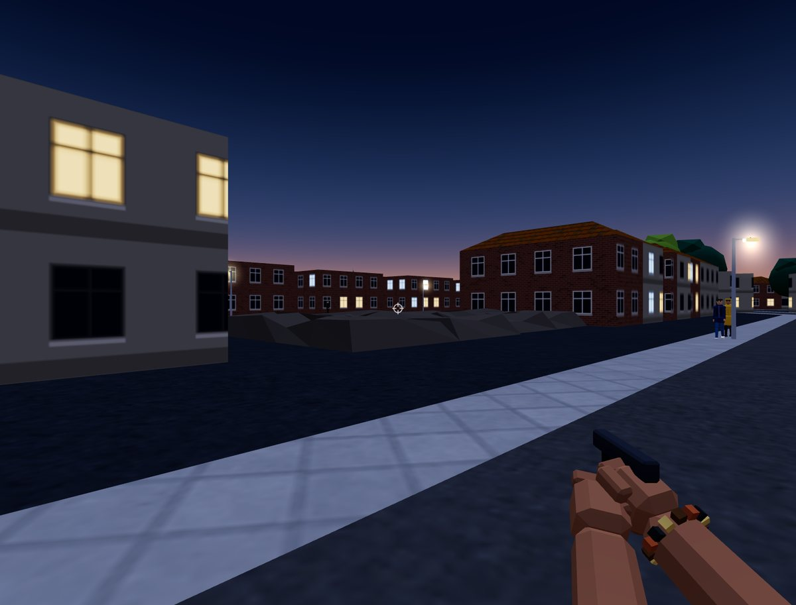
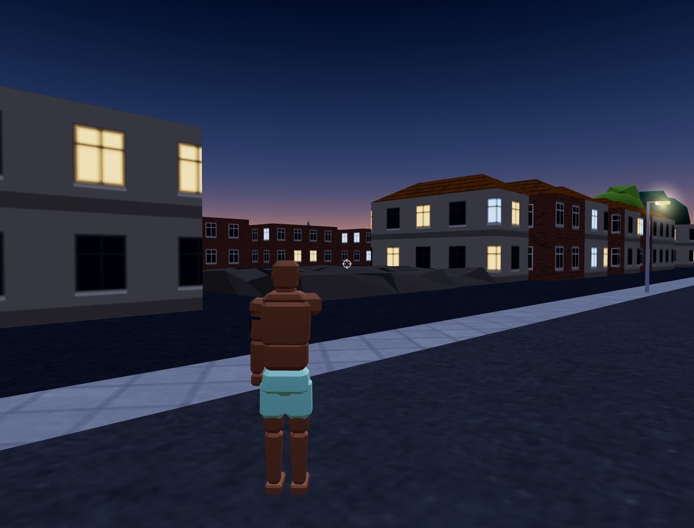
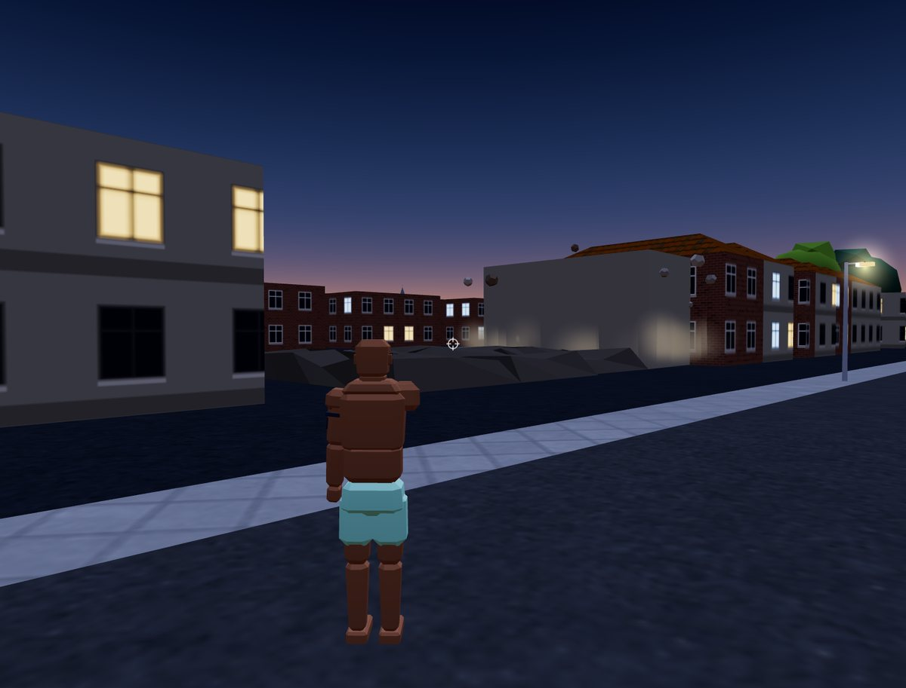
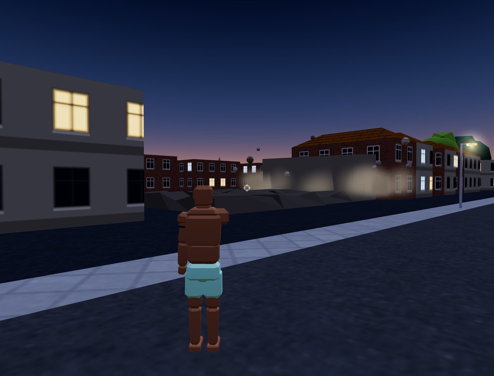
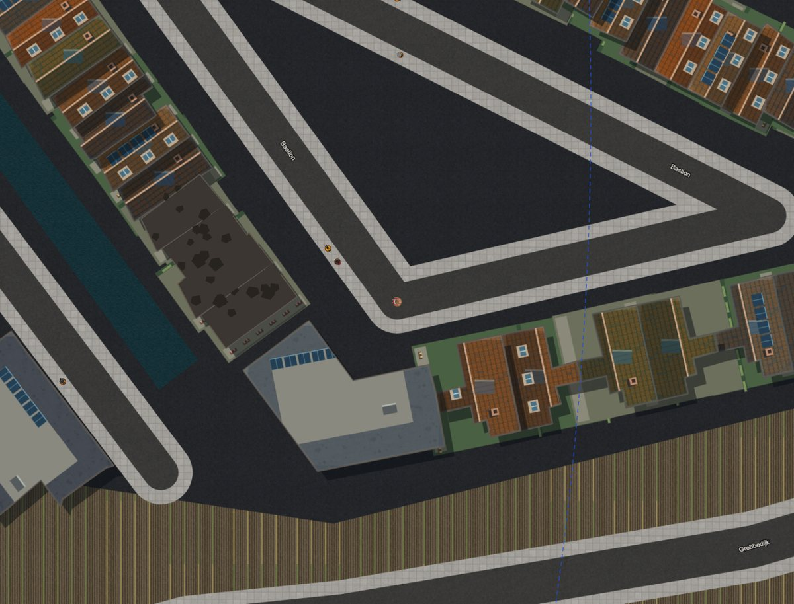

# GTA H3 — 3D mode

## Summary

A second, optional renderer over the unchanged 2D simulation (spec:
`docs/superpowers/specs/2026-09-26-arena-3d-mode-design.md`). The player can switch between a
top-down 2D view and a third- or first-person 3D view of the same match at any time; every other
client keeps seeing whatever mode it is in. Nothing about the simulation, netcode or scoring
differs between the two — 3D is presentation only, built from the same `Scene` the 2D renderer
already draws.

Shipped alongside 3D: networked destructible buildings (sim-side health, collapse and rebuild,
rendered as ruins in both 2D and 3D), a rocket launcher, and 3D-only guidance (navigation ribbon,
mission beacons, player markers, a zone wall). Protocol version is **4**.

## Screenshots

Captured in the dev build (Wageningen, dusk):

|                                                                                   |                                                                                  |
| --------------------------------------------------------------------------------- | -------------------------------------------------------------------------------- |
|  |  |
|         |       |

The same ruins in the 2D view: 

## Architecture

### A second renderer, not a replacement

The 2D renderer (`src/lib/cityArena/render/`) keeps running exactly as before; 3D
(`src/lib/cityArena/render3d/`) is an alternative way to draw the same per-frame `Scene` — players,
peds, cops, vehicles, bullets, effects, structures — that `arenaRuntime.ts` builds every frame
regardless of which view is active. Switching modes never touches the simulation, the network
client or the HUD state; it only changes which renderer reads that frame's `Scene`.

### Dynamic import

`src/lib/cityArena/render3d/index.ts` is the 3D view's only public entry point:

> Everything outside `render3d/` and `components/cityArena/view3d/` may import from here with
> `import type` only.

`src/components/cityArena/view3d/useView3d.ts` loads the whole module with one dynamic
`import("@/lib/cityArena/render3d")`, the first time a player switches to 3D — so three.js and
every render3d file stay out of the 2D game's bundle for players who never open 3D. A device
without WebGL2 throws `WebGl2UnavailableError` from `createView3d`, which the hook catches, shows
"3D werkt niet op dit apparaat" for 4 seconds and falls back to 2D; that failure is reported as a
Sentry breadcrumb, not an exception (AGENTS.md's Sentry-noise policy — no WebGL2 is expected on
some devices). Any other failure while starting or rendering 3D goes to Sentry as a real error and
also falls back to 2D.

### Canvas stacking

The 3D view renders into its own WebGL `<canvas>`, created fresh on every mount
(`mountView3d` in `useView3d.ts`) and stacked **under** the existing 2D canvas inside
`View3dLayer` (`components/cityArena/view3d/View3dLayers.tsx`). In 3D mode the 2D canvas is
cleared every frame and repainted as a transparent HUD layer (crosshair, off-screen friend arrows,
the click-to-aim hint, the failure toast) by `render3d/overlay3d.ts`; it keeps every pointer, wheel
and touch event, so none of the existing 2D input bindings move. The WebGL layer itself has
`pointer-events: none`. Split screen and the TV screen (`/arena/scherm`) stay 2D — see Known
limitations.

### Module map: `src/lib/cityArena/render3d/`

Grouped by responsibility; every exported symbol carries its own JSDoc.

**Entry point, renderer and shared plumbing**

| File             | Responsibility                                                                                                     |
| ---------------- | ------------------------------------------------------------------------------------------------------------------ |
| `index.ts`       | `createView3d(canvas)`: wires every layer together, places the camera, drives one frame                            |
| `renderer3d.ts`  | WebGL renderer, three.js scene, camera, evening lights, fog; `RenderQuality`, view distance and pixel-ratio tables |
| `cameraRig.ts`   | Third-person and first-person rigs, pitch limits per mode, car chase and death-orbit poses                         |
| `coords.ts`      | The one world ↔ three.js mapping (`(x, y)` metres → `(x, height, y)`) and angle helpers                            |
| `idHash.ts`      | Deterministic per-id "randomness" (façade choice, tree size/turn) so every device builds the same town             |
| `disposal.ts`    | `disposeObject`: frees geometries, materials and textures of a whole `Object3D` subtree                            |
| `meshBuffers.ts` | Growable vertex/index buffers the city builders fill, turned into one indexed `BufferGeometry`                     |
| `lowPoly.ts`     | Bevelled/tapered block and faceted-rod primitives, vertex-coloured and flat-shaded                                 |
| `footprint.ts`   | Footprint measurements (centre, longest edge) shared by roofs, landmark dressing and ruins                         |
| `testing/`       | Shared test doubles/helpers for render3d's own test suite                                                          |

**The streamed city**

| File                  | Responsibility                                                                                                                                                             |
| --------------------- | -------------------------------------------------------------------------------------------------------------------------------------------------------------------------- |
| `city3d.ts`           | Owns the shared `WorldMaterials` and the streamed cells; rebuilds a cell when a landmark lookup changes                                                                    |
| `cellGrid.ts`         | The 128 m cell grid, counted from the world origin                                                                                                                         |
| `worldCells.ts`       | Streams cells around the camera under a time budget, drops far ones, rebuilds a cell when a building in it falls, rebuilds or its tile arrives, scorches damaged buildings |
| `buildCell.ts`        | One cell's merged geometry from the decoded map tiles: ground, roads, buildings, trees, furniture                                                                          |
| `worldMaterials.ts`   | The materials every cell shares (never owned or disposed per cell)                                                                                                         |
| `textures.ts`         | Loads the 2D surface art as repeating textures; paints façade textures (brick/plaster/glass, lit windows) on a canvas from a seed                                          |
| `sky.ts`              | The evening sky dome, fog-matched at the horizon                                                                                                                           |
| `roadMesh.ts`         | Road ribbons, centre-line markings, street lamps along the pavements                                                                                                       |
| `buildingMesh.ts`     | Extruded walls with façade textures; roofs by the 2D map's own tile-vs-gravel rule                                                                                         |
| `pitchedRoof.ts`      | A ridge-and-gable roof for non-rectangular footprints (churches, pools)                                                                                                    |
| `treeMesh.ts`         | Instanced trunks and canopies, two greens                                                                                                                                  |
| `furnitureMesh.ts`    | Instanced lamps/benches/bus shelters with a pose proxy for cosmetic knock-over                                                                                             |
| `landmarkDressing.ts` | Per-landmark silhouettes (church spire, pool glass hall, campus glass, café awning, brewery chimney)                                                                       |

**Characters and vehicles**

| File                                         | Responsibility                                                                      |
| -------------------------------------------- | ----------------------------------------------------------------------------------- |
| `characters.ts`                              | A posable 3D person: one rigid-skinned mesh, weapon in hand, lies down when dead    |
| `characterRig.ts`                            | The shared 17-bone rig and per-look merged geometry                                 |
| `characterPose.ts`                           | Pure procedural poses: idle, walk/run (phased by distance), aim, death              |
| `characterLooks.ts`                          | The cast's looks, translated from the 2D sprites' sampled colours                   |
| `characterParts.ts`                          | Body/face/hair as rigid low-poly parts bound to one bone each                       |
| `characterExtras.ts`                         | Accessories (shades, caps, hoods, backpack, hi-vis) layered over a look             |
| `vehicles3d.ts`                              | A live vehicle: wheel roll, light bar, tank turret follow, wreck look, over a model |
| `vehicleModels.ts`                           | Procedural low-poly model per vehicle kind, one merged body mesh + wheels           |
| `vehicleParts.ts`                            | Shared material cache and primitive shapes vehicles are cut from                    |
| `vehicleShapes.ts` / `vehicleShapesHeavy.ts` | Per-kind shape builders (passenger kinds; bus/tractor/tank)                         |
| `vehicleSmoke.ts`                            | Wreck column smoke and bonnet smoke below the 2D `smokeHealthOf` threshold          |

**Weapons, view model and projectiles**

| File                  | Responsibility                                                                                             |
| --------------------- | ---------------------------------------------------------------------------------------------------------- |
| `weapons3d.ts`        | Small procedural weapon models, shared between a character's hand and first person                         |
| `viewmodel.ts`        | First-person forearms/fists: stride bob, shot kick, punch/swing, weapon-change dip                         |
| `viewModelPass.ts`    | Draws the view model in a pass of its own (its own near-clipped camera) so it never pokes through geometry |
| `projectiles3d.ts`    | Pooled rockets and cannon shells (by bullet id), trails laid by distance flown                             |
| `projectileModels.ts` | Shared rocket and shell geometry/materials                                                                 |
| `tracers.ts`          | One shared `LineSegments` draw call for every gun round in flight                                          |

**Pickups, effects and destruction**

| File                                   | Responsibility                                                                              |
| -------------------------------------- | ------------------------------------------------------------------------------------------- |
| `pickups3d.ts`                         | Spinning/bobbing item models over an additive glow disc, hidden once taken                  |
| `effects3d.ts`                         | Owns the fire/smoke particle budgets and the debris pool; syncs bursts per effect id        |
| `particles.ts` / `particleMaterial.ts` | Pooled `Points` particle systems and their procedural soft-sprite shader                    |
| `debris.ts`                            | Tumbling low-poly chunks in one `InstancedMesh`                                             |
| `fxEmit.ts`                            | Data-driven puff/chunk specs plus seeded emitters                                           |
| `flashes.ts` / `fireballMaterial.ts`   | Muzzle flashes and explosion fireballs, a pooled `PointLight` set                           |
| `glowMaterial.ts`                      | Shared additive glow shader (beacons, pickups, lamp heads)                                  |
| `destruction3d.ts`                     | Collapse stand-in, rubble mounds (`RUBBLE_COLOUR`), furniture knock-over                    |
| `ruinGeometry.ts`                      | Footprint prism and jittered rubble-mound geometry                                          |
| `ruins3d.ts`                           | Finds new collapses by diffing the frame's destroyed-structure ids against the last frame's |
| `knockOver3d.ts`                       | Knocks furniture over near fast cars and fresh explosions                                   |
| `toppling.ts`                          | The generic 90°-tip animation `destruction3d.ts` and `knockOver3d.ts` share                 |

**Guidance, cast and HUD**

| File                 | Responsibility                                                                          |
| -------------------- | --------------------------------------------------------------------------------------- |
| `cast3d.ts`          | One frame step: entity sync, mission contacts, effects, destruction, first-person hands |
| `entities.ts`        | Per-frame pooled sync of players/peds/cops/cars/pickups from the blended `Scene`        |
| `entityPool.ts`      | Recycles scene objects per entity id through free lists keyed by look/vehicle variant   |
| `entityMotion.ts`    | Infers walk speed, gait phase and wheel turn between frames (pure, allocation-free)     |
| `entityShots.ts`     | Who fired this frame, for character recoil and the view model                           |
| `guidance3d.ts`      | Owns the route, beacons, zone wall and player markers layers                            |
| `route3d.ts`         | The glowing navigation band along the route, rebuilt only when the route changes        |
| `beacons3d.ts`       | Pulsing light columns over mission contacts/objectives, readable from far away          |
| `contacts3d.ts`      | Mission contacts as idle characters in their 2D look                                    |
| `zoneWall3d.ts`      | The match zone's edge as a wall of light, built only near the player                    |
| `playerMarkers3d.ts` | A camera-facing diamond over every other living player                                  |
| `playerArrows.ts`    | Edge-of-screen arrows toward friends who are out of view                                |
| `missionMarkers.ts`  | Pure read of the scene's mission contacts/objectives for `guidance3d`/`contacts3d`      |
| `overlay3d.ts`       | The 2D HUD canvas overlay: crosshair and off-screen arrows                              |

## Input

### Camera-relative movement

`src/lib/cityArena/input/cameraInput.ts` (`cameraRelativeInput`) rotates the simulation's raw
`WorldInput.move` into the camera's frame before it reaches the (unchanged) simulation: on foot,
and for an analog stick in a car, "forward" always means "along the camera", while a keyboard
driving a car keeps its tank steering (W gas, A/D steer) untouched. The flat sim's `aim` angle is
replaced by the camera's own look yaw, since 3D gives the player no 2D canvas point to aim at.
`src/lib/cityArena/input/cameraYaw.ts` supplies the camera's own motion besides the mouse: the
third-person chase eases behind the car after `CHASE_IDLE_S` = 1.2 s of a resting mouse, the
driver's seat is bolted to the car and only offset by the mouse, and — with no aim stick held — a
lone movement stick slowly turns the camera toward the walking direction so a touch player without
a second stick can still look around.

### Mouse-look and the lock-free fallback

`src/lib/cityArena/input/mouseLook.ts` (`attachMouseLook`) binds to the 2D canvas: a primary click
requests the browser's pointer lock, and while locked, pointer movement turns yaw/pitch at
`MOUSE_SENSITIVITY_RAD_PER_PX` = 0.0024 rad/px. Pointer lock is refused in some embedded browsers
and sandboxed frames (`requestPointerLock()` rejecting is expected, not a bug) — that refusal is a
Sentry breadcrumb, and mouse-look falls back to **lock-free** mode: plain `pointermove` events over
the canvas turn the camera without any button held, and every click still retries the real lock.
`View3dLayer` shows "Klik om te richten · V wisselt camera" on a fine (mouse) pointer until the
player has either locked the pointer or triggered the lock-free fallback.

### V — camera toggle

`KeyV` (`src/lib/cityArena/input/keyboard.ts`, `TOGGLE_CAMERA_KEY`) switches between third and
first person. Pitch is clamped per mode (`pitchLimitsFor` in `cameraRig.ts`): roughly −35°…+40° in
third person, ±30° in first person; `useView3d` re-applies the limits whenever the mode changes.

### Touch

The existing camera-relative touch aim stick pushes the camera yaw the same way a gamepad stick
does (`stickTurnedYaw` in `cameraYaw.ts`); without an aim stick held, the movement stick nudges the
camera as described above. No new touch controls were added for 3D — the existing twin-stick and
single-stick layouts (`docs/tech/arena/README.md`, Plan 6) drive it unchanged.

## Destructible buildings

Sim-side logic lives entirely in `src/lib/cityArena/sim/structures.ts` and is identical for 2D and
3D clients; only the drawing differs.

### Identity and health

`src/lib/cityArena/world/structureId.ts` packs a structure id from the map tile a building piece
sits in plus its position in that tile's building list (`structureIdOf`/`structureTileOf`), so
every device that loaded the same map version agrees on ids without any wire lookup table.
`structureMaxHealth(ring, levels, landmark)` is `area × max(1, levels) × 1.2` (`STRUCTURE_HEALTH_PER_M2_LEVEL`),
clamped to `[120, 1800]` (`MIN_STRUCTURE_HEALTH`…`MAX_STRUCTURE_HEALTH`); a landmark's health is
`Infinity` — landmarks never fall, since missions anchor on them. `ArenaState.structures` is
sparse: a building nobody has hit has no entry and is implicitly at full health, capped at
`MAX_STRUCTURES` = 48 tracked entries (the least-damaged intact one is dropped first).

### Damage sources

| Source                      | Amount                                                     | Radius                  | Falloff                                                                             |
| --------------------------- | ---------------------------------------------------------- | ----------------------- | ----------------------------------------------------------------------------------- |
| A bullet hit                | `BULLET_STRUCTURE_FACTOR` (0.25) × the bullet's own damage | — (direct hit)          | —                                                                                   |
| Car explosion (`CAR_BLAST`) | 260 at the blast centre                                    | 6 m (`structureRadius`) | Yes, on structures only — the same blast's damage to people/cars near it stays flat |
| Tank cannon shell           | 320 at the blast centre                                    | 5 m                     | Yes                                                                                 |
| Rocket                      | 420 at the blast centre                                    | 5 m                     | Yes                                                                                 |

A building's accumulated `damage` heals away after `STRUCTURE_HEAL_TICKS` = 2700 ticks (90 s)
without a hit, once it is still standing.

### Collapse and rebuild

Once accumulated damage reaches a structure's max health, `damageStructure` marks it destroyed at
the current tick and crushes everyone and everything still in or within `CRUSH_MARGIN_M` (1.5 m)
of its footprint — 60 damage to a person on foot or a pedestrian/cop, 120 to a car — and pushes one
`collapse` event plus a `kill` event per victim it finishes off. A destroyed structure rebuilds
(`stepStructures`) once `STRUCTURE_REBUILD_TICKS` = 7200 ticks (4 minutes) have passed **and**
nobody living still stands in its footprint; the timer alone does not rebuild an occupied ruin.

### On the wire (protocol 4)

`ARENA_PROTOCOL_VERSION` (`net/roomProtocol.ts`) is **4**. The snapshot's `z` field
(`encodeStructures`/`decodeStructures` in `net/snapshotWire.ts`) carries one row per non-default
structure — `[id, damage, destroyedAtTick | NONE, lastHitTick]` — and is omitted entirely when no
structure has ever been hit, so an untouched city costs nothing on the wire. Older protocol-3 rows
are rejected outright by the version bump rather than silently misread, since the rocket weapon and
its pickup also widened the wire's weapon/pickup-kind lists in the same release.

### Client prediction through ruins

`net/predictLocal.ts` builds its local-movement collision grid with
`withoutStructures(collision, destroyedStructureIds(state))` — exactly the helper the host
simulation itself uses (`sim/arena.ts`) — so a non-host client's predicted movement passes through
a collapsed building's footprint the same tick the host's does. Without this, a player would
rubber-band against a ruin's invisible old walls until the next authoritative snapshot arrived.

### Drawing ruins in 2D and 3D

Both renderers read the same sparse `structures` list; neither receives the simulation's
`collapse` event directly (it never crosses the wire — see `ruins3d.ts`'s module comment). In 3D,
`ruins3d.ts` compares each frame's destroyed ids against the previous frame's: an id destroyed
within the last `RECENT_COLLAPSE_S` = 2 seconds plays the fall (`destruction3d.ts`'s sinking,
tilting, dust and debris prism), while an older or newly-loaded ruin simply appears as a finished
rubble mound — the same distinction a player would see switching to 3D mid-match or walking into
range of an old ruin for the first time. `worldCells.ts` rebuilds the affected city cell when a
building in it collapses or rebuilds, and re-applies any furniture already knocked over across
that rebuild.

## Rocket launcher

**Raketwerper** (`WeaponKind: "rocket"`, key **6**, last in `WEAPON_ORDER`/the weapon-select
cycle): 60 direct damage, 0.6 shots/s (50-tick cooldown), 90 m range, 45 m/s projectile speed, a
4-round magazine and 12 rounds max carried. It is a magazine weapon like the Uzi/shotgun/rifle/bat.
Its blast (`EXPLOSIVES.rocket`) is what actually damages buildings and nearby entities: 420
structure damage and 70 entity/90 vehicle damage within a 5 m radius, with falloff. One rocket
pickup spot exists per zone (`ROCKET_PICKUPS_PER_ZONE` in `sim/pickups.ts`), placed after the bat
spots, and grants 4 rounds (`PICKUP_ROUNDS.rocket`). The tank's cannon shell uses the same
`EXPLOSIVES` blast shape and also damages buildings (320 structure damage, 5 m radius) — see the
damage sources table above.

## Performance notes

- **View distance by quality** (`renderer3d.ts`, `VIEW_DISTANCE_M`): 260 m at "laag", 380 m at
  "auto" (dropping to 260 m on a phone-width viewport, matching the 2D view's own render-scale
  rule), 520 m at "hoog". Fog closes exactly at the view distance; cells are kept resident out to
  1.4× that distance (`KEEP_DISTANCE_FACTOR`) before disposal, to avoid rebuilding a cell the
  camera is only briefly outside.
- **Device pixel ratio cap** (`MAX_PIXEL_RATIO`): 1 at "laag", 1.5 at "auto", 2 at "hoog".
- **Cell build budget**: `WORLD_BUILD_BUDGET_MS` = 4 ms per frame for streaming in new/rebuilt
  city cells, nearest first; a cell whose build would exceed the budget waits for a later frame.
- **Particle budget by quality** (`cast3d.ts`, `EFFECT_PARTICLES`): 600 (laag) / 1200 (auto) / 1600
  (hoog) particles alive at once across fire and smoke together, set once by the first frame's
  quality and shared with the destruction system's dust.
- **Draw calls**: roughly 15–25 per dense city cell (190–290 across a typical view), 8–10 per
  vehicle, and characters/pickups/weapons each merge to one or two draw calls via shared,
  vertex-coloured, per-look/per-kind geometry.

## Known limitations

- **Bullets stay in the simulation's flat plane.** The 2D simulation has no concept of height, so a
  bullet's vertical position in 3D is presentation only (interpolated for the crosshair and
  tracers); aiming up or down changes where the 3D camera looks, not what the flat hit-scan can
  actually hit. The crosshair is deliberately drawn on the true in-plane shot line so it never lies
  about this.
- **A remote tank's turret always faces forward.** Turret aim is not on the wire — only the
  driver's own client knows where their mouse points — so `vehicles3d.ts`'s `aimTurret` points a
  tank's turret straight ahead for everyone except the player actually driving it.
- **3D is not available on the TV screen or split screen.** `/arena/scherm` and multi-player split
  screen keep rendering 2D only; `useView3d`/`View3dLayer` are wired into the single-player overlay
  (`CityArenaOverlay.tsx`/`useArenaGame.ts`) alone.
- **Mission boarding passengers are not drawn in 3D.** A scripted mission passenger who boards a
  vehicle is a 2D-only visual; the 3D cast does not yet seat one in the car model.
