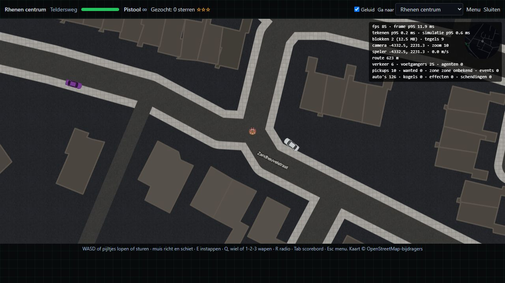
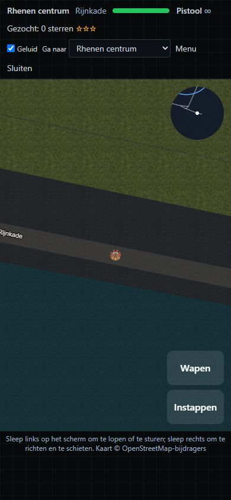

# GTA H3: performance, security and graphics audit

Date: 12 September 2026 · Commit: `18cee84` · Application version: `0.2.1`

GTA H3 has a promising, well-tested simulation and a recognizable visual identity. Its main release blocker is the identity boundary: the multiplayer APIs can treat an unsigned anonymous cookie as another user's identity. Fix that before expanding multiplayer access. Improve network efficiency and phone readability next; the measurements do not justify replacing the engine.

## Current rating

| Area                      | Score / 10 | Assessment                                                                                                                              | Confidence                                                                           |
| ------------------------- | ---------: | --------------------------------------------------------------------------------------------------------------------------------------- | ------------------------------------------------------------------------------------ |
| Performance               |    **6.5** | Efficient core simulation and modest map assets; avoidable network traffic, incomplete frame measurement and no validated phone budget. | Medium                                                                               |
| Security                  |    **2.0** | Critical identity flaw plus reproducible host disruption and authority weaknesses.                                                      | High for source and local reproductions; production exploitability was not exercised |
| Graphics and presentation |    **6.0** | Coherent palette and useful map detail; flat buildings, inconsistent entity art and a crowded phone HUD.                                | Medium; visual inspection used the actual components in an isolated fixture          |
| Weighted overall          |    **4.6** | Functional alpha, with security work required before broader multiplayer rollout.                                                       | Provisional                                                                          |

The overall score is `performance × 35% + security × 40% + graphics × 25%`, rounded to one decimal. These are audit judgments, not Lighthouse or certification scores. Scale: 1–2 severe weaknesses; 3–4 fragile; 5–6 functional with material gaps; 7–8 robust and polished; 9–10 extensively validated. A critical security finding blocks rollout regardless of the average.

## Scope and evidence

Reviewed the game renderer, simulation, map and sprite loaders, input and multiplayer loops, room election, result persistence, four arena API routes, shared identity helper, rate limits, middleware and relevant dependencies.

Validation performed:

- **934 tests passed across 128 test files**, covering the selected arena library, components, API tests, match service and identity helper.
- **TypeScript passed** using `npx tsc --noEmit`.
- Targeted ESLint: **zero errors, one existing effect-cleanup warning** in `useArenaRoom.ts:303`.
- `npm audit --omit=dev`: **four high-severity package entries**, representing three advisory records in two underlying libraries; reachability is discussed below.
- Eight CPU scenarios using the committed map: four zones × one/eight players, with 300 warmup and 1,800 measured ticks per scenario.
- Local malformed-input, role-election and result-schema probes. No hostile messages or forged identities were sent to production.
- Browser inspection at **1280 × 720**, **390 × 844** and **844 × 390** CSS pixels, including practice play and HUD layout.

The installed dependencies initially differed from the lockfile: Ably was absent, Next was 16.3.3 and Vitest was 4.1.11. `npm ci --no-audit --no-fund` restored the locked dependencies, including Next 16.3.4, Ably 2.28.0 and Vitest 5.0.0. The initial missing-Ably build/test failures were an environment problem, not a game defect. The successful test results above are from the subsequent run.

Runtime: Windows, AMD Ryzen 7 7700, Node **24.19.0**. The repository targets Node **22**; rerun acceptance measurements on that runtime. CPU probes ran alongside the test suite, so their timings are indicative rather than controlled comparative benchmarks.

The browser fixture renders the real `CityArenaOverlay`, game hooks, CSS, map and sprites through Vite. It substitutes the repository's in-memory transport for Ably, suppresses external Sentry reporting, and uses an image adapter instead of Next Image. It binds native `fetch` because the standalone fixture otherwise exposed an illegal-receiver error in `mapLoader`'s `options.fetchImpl(url)` call. These adaptations isolate visuals from accounts and production services; they are **not** a production end-to-end test. Next font loading, Next image optimization, real network latency and physical touch hardware were not validated. The landscape viewport retained desktop pointer characteristics.

No production build/bundle analysis, live multi-user Ably session, physical iOS/Android test, prolonged memory/thermal test, production response-header review or full application penetration test was completed. No test-coverage percentage is claimed; the workspace's `enabled_tests.txt` and `coverage_report.md` were not present.

## Security findings

### S1 — Critical / P0: unsigned identity permits impersonation

**Evidence:** [activeUser.ts:42](C:/Users/Guido/Projects/H3-Teamy/src/lib/activeUser.ts:42) looks up a non-UUID `anon_id` as a user ID. Its [anonymous path:299](C:/Users/Guido/Projects/H3-Teamy/src/lib/activeUser.ts:299) returns that user when there is no authenticated session. The [token route:69](C:/Users/Guido/Projects/H3-Teamy/src/app/api/arena/realtime-token/route.ts:69) uses this result as the signed Ably `clientId`. The public [leaderboard response:195](C:/Users/Guido/Projects/H3-Teamy/src/lib/services/arenaMatchService.ts:195) exposes user IDs. Middleware only creates a missing anonymous cookie; it does not authenticate existing values.

The existing test `treats anon_id equal to an existing user id as legacy cookie and skips cookie identity lookup` **passes with a null session**. It therefore verifies the vulnerable behavior rather than preventing it. The launcher login check is client-side and does not secure the API.

**Impact:** a caller knowing a user ID can obtain an arena identity representing that user, undermining attribution, host checks and per-user limits. New anonymous identities are also created before the token/match rate limit, allowing identity churn to weaken those limits and create database work. Other consumers of the shared helper merit a separate review; this audit does not claim takeover of every account feature.

**Fix:** require a valid server session and eligible account before issuing multiplayer tokens or accepting results. Remove bare-user-ID authentication from the anonymous helper. Preserve guest flows through an opaque server-bound guest identity; migrate legacy cookies only after authenticated proof. Apply an IP/global abuse limit before database identity work. Replace the vulnerable test with rejection cases and test the actual route plus helper together. Assess already-issued tokens and choose expiry/revocation deliberately.

### S2 — High / P1: room access and host authority trust the client

**Evidence:** the [token capability:30](C:/Users/Guido/Projects/H3-Teamy/src/app/api/arena/realtime-token/route.ts:30) grants publish, subscribe and presence on `arena:room:*`. [Election:27](C:/Users/Guido/Projects/H3-Teamy/src/lib/cityArena/net/election.ts:27) prioritizes self-declared `display` over desktop players. A local probe with an established desktop player and a later `display` selected the newcomer through both `electHost` and `actingHost` when both had fresh state sightings.

**Impact:** a token holder can access any known room channel, bypass UI join restrictions and assert a higher-priority role. Combined with publication rights, this can displace a legitimate host. S1 increases the exposure, but fixing S1 alone does not fix S2. The server checks snapshot publisher/time for acting-host selection, not authoritative role provenance or a validated match lifecycle.

**Fix:** introduce server-approved room membership and a host lease/epoch, then issue capabilities for the permitted room and operations. Separate host-state publication from player-input publication. Device hints may guide election but must not grant authority. Test newcomers, full-room joins, reconnects and migration. Ably supports channel-specific token capabilities; a trailing wildcard also covers child channels. [Ably capability documentation](https://ably.com/docs/auth/capabilities).

### S3 — High / P1: a malformed input can stop the host

**Evidence:** [hostLoop.ts:161](C:/Users/Guido/Projects/H3-Teamy/src/lib/cityArena/net/hostLoop.ts:161) casts `message.data` to an input array before validating its container. `decodeInput` sanitizes numeric fields but destructures the input as an iterable. The local in-memory probe sent an object with a sequence field from a seated test client. Five failed simulation attempts left **`publishing: false`, `tick: 0`**. No real Ably connection was used.

**Impact:** one seated client can interrupt the match and provoke repeated host failures. Catching simulation errors is insufficient when the same invalid pending input remains in the loop. Snapshot decoding likewise trusts collection shape and counts after checking the sender.

**Fix:** reject malformed messages before storing them. Validate exact input shape, finite bounded numbers, flags and sequence progression; add snapshot version, row-count, row-width and payload-size limits. Drop invalid messages with bounded diagnostics. Verify that malformed input from one peer does not stop healthy players or trigger Sentry floods.

### S4 — High / P1: result recording has no server-owned match lifecycle

**Evidence:** [PostMatchSchema:46](C:/Users/Guido/Projects/H3-Teamy/src/lib/schemas/arena.ts:46) validates timestamp syntax but not ordering, duration or recency. It does not require distinct result users. [recordMatch:93](C:/Users/Guido/Projects/H3-Teamy/src/lib/services/arenaMatchService.ts:93) checks current presence and deduplicates on client-supplied `(roomCode, startedAt)`. The probe accepted a schema payload with a future start, an earlier end and duplicate users. This proves schema acceptance, not successful database insertion of duplicates.

**Impact:** a host can vary start times to submit multiple plausible-looking results without a server-recorded match start. Current presence also excludes someone who legitimately played but disconnected before submission. Score caps and idempotency help, but neither establishes that a match took place.

**Fix:** create a server match ID at start, record membership/host changes and completion state, and accept one bounded result set per match. Validate chronological order, expected duration, distinct users and roster eligibility. Keep casual host-reported scores explicitly unverified. Fully cheat-resistant competition would require trusted simulation or stronger verification; that is a separate architectural decision.

### S5 — Medium / P2: dependency advisories need reachability triage

The lockfile includes `deepmerge-ts` 7.1.5 and `mysql2` 3.15.3 through Prisma tooling. npm reports high entries for those packages and their parents `@prisma/config` and `prisma`; these are **not four independent exploitable game vulnerabilities**.

- Recursive-object merging can exhaust the stack in affected DeepmergeTS versions. [Advisory](https://github.com/advisories/GHSA-ggr8-5vv4-36mx).
- A MySQL authentication downgrade can expose credentials, and the compressed protocol has a separate decompression risk. [Authentication advisory](https://github.com/advisories/GHSA-3f6p-5ww8-9rcr), [compression advisory](https://github.com/advisories/GHSA-rgwj-5xj2-c3m3).

The app uses PostgreSQL, and this review found no arena-controlled recursive config merge or MySQL connection. Runtime reachability is therefore **not established**. Review the deployed dependency trace, isolate tooling where feasible, and update through a compatible Prisma release. Do not apply npm's proposed forced downgrade to Prisma 6 blindly. Retain the repository's TypeScript pin.

## Performance findings and measurements

### What is already good

The overlay is dynamically imported. The world streams nine resident tiles, keeps a byte-budgeted LRU raster, and paints at most one missing chunk per draw. Entities are bounded, the host simulation uses fixed 30 Hz steps with catch-up limits, and snapshots run at 10 Hz. Audio and art have fallbacks. Radio media uses `preload="none"`, so the entire radio collection is not an initial download.

| Committed asset group     |     Uncompressed size | Interpretation                                                                                             |
| ------------------------- | --------------------: | ---------------------------------------------------------------------------------------------------------- |
| Map JSON                  | approximately 3.80 MB | **1,165,764 bytes / 1.11 MiB gzip** across the index, roads and 35 tiles; gzip calculated locally per file |
| Sprite set and manifest   |         223,954 bytes | Small; removing detail to save transfer size is not a priority                                             |
| Effects audio and credits |         232,841 bytes | Modest footprint                                                                                           |
| Radio and credits         |               8.65 MB | Six tracks, approximately 1.44 MB each; loaded as needed                                                   |
| All `public/arena` files  |              12.90 MB | Stored asset inventory, **not startup transfer**; excludes branding assets elsewhere                       |

The largest tile is 681,658 bytes raw / 204,543 bytes gzip. `roads.json` is 513,363 bytes raw / 187,944 bytes gzip. Production compression and first-load transfer were not measured.

| Zone       | 1-player simulation p95 | 8-player simulation p95 | 8-player median snapshot JSON |
| ---------- | ----------------------: | ----------------------: | ----------------------------: |
| Rhenen     |                0.501 ms |                0.597 ms |                   6,181 bytes |
| Wageningen |                0.384 ms |                0.550 ms |                   6,097 bytes |
| WUR-campus |                0.368 ms |                0.497 ms |                   6,169 bytes |
| Bennekom   |                0.398 ms |                0.516 ms |                   6,199 bytes |

These CPU probes use the real geometry with all tiles resident and synthetic moving/firing players. They exclude drawing, tile streaming, real transport, UI and client reconciliation. They are not maximum-wanted stress runs. Two scenarios had isolated roughly 10–12 ms maximum ticks; this run cannot attribute those stalls.

A warm, stationary desktop browser sample displayed roughly **85 fps**, **11.9 ms frame p95**, **0.2 ms draw p95**, **0.5–0.6 ms simulation p95**, nine resident tiles and **12.5 MiB** of cached rasters. This is a short debug-window observation in the fixture, not a sustained production or mobile performance score. It does show that this simple warm scene is inexpensive on the audit desktop.

### P1 — Medium / P2: excessive idle network work and broad prediction

[clientLoop.ts:136](C:/Users/Guido/Projects/H3-Teamy/src/lib/cityArena/net/clientLoop.ts:136) publishes an input every predicted tick, including unchanged input. Seven remote players plus one host therefore produce approximately **220 publications/second**: `7 × 30` inputs + `10` snapshots, excluding presence and retries. This is a code-derived message count, not an Ably billing estimate.

Measured full-state JSON is about 6.1–6.2 KB per eight-player snapshot: around **61–62 KB/s**, or roughly **11 MB per three-minute match per subscriber**, before protocol overhead or compression. Seats, tally and acknowledgement metadata were omitted from the size probe, so actual payloads can be larger. Snapshots include roughly 128–130 vehicles even though most are not near the player. Both prediction and reconciliation call the full `stepArena` pipeline.

**Improve:** separate simulation ticks from input transmission; send changed input plus a keepalive compatible with input expiry. Start with at most 15–20 Hz active inputs and about 2 Hz idle heartbeat, with a timeout allowing jitter. Then measure whether parked-state deltas or interest filtering are worthwhile. Keep periodic full snapshots for late join and recovery. Narrow replay to the local movement dependencies only after adding parity tests.

### P2 — Medium / P2: hidden tabs keep doing visual work

[arenaRuntime.ts:889](C:/Users/Guido/Projects/H3-Teamy/src/components/cityArena/arenaRuntime.ts:889) swaps animation frames for a hidden-tab interval, but both invoke `runFrame`, including canvas drawing and HUD refresh. Keeping a host alive is useful; redrawing its invisible canvas is unnecessary. Browser background throttling also prevents the interval from guaranteeing reliable 30 Hz hosting. [Page Visibility documentation](https://developer.mozilla.org/en-US/docs/Web/API/Page_Visibility_API).

**Improve:** separate simulation/network maintenance from rendering. Hidden hosts retain only necessary work and can relinquish their lease when throttled; hidden clients stop drawing and use a minimal input/connection policy. Measure zero draw calls while hidden and test host migration on tab suspension.

### P3 — Medium / P2: frame diagnostics conceal severe stalls

[computeFrameDt:734](C:/Users/Guido/Projects/H3-Teamy/src/components/cityArena/arenaRuntime.ts:734) clamps elapsed time to 100 ms. [Frame recording:882](C:/Users/Guido/Projects/H3-Teamy/src/components/cityArena/arenaRuntime.ts:882) records that clamped value. A 500 ms stall therefore enters the metrics as 100 ms. The buffer contains only 120 samples, and displayed fps is derived from the median rather than total rendered frames over elapsed time.

**Improve:** record raw frame intervals separately from safe simulation deltas. Report p50/p95/p99, worst frame, long frames, raster time and missing chunks over a complete scripted route. Label median-derived fps accurately or replace it with a wall-clock rate. Correct this before using debug metrics as acceptance evidence.

### P4 — Medium / P2: raster work lacks a time budget and device quality policy

[Static rasterization](C:/Users/Guido/Projects/H3-Teamy/src/lib/cityArena/render/staticRaster.ts) limits chunk count per frame, not milliseconds. [paintLabels:267](C:/Users/Guido/Projects/H3-Teamy/src/lib/cityArena/render/drawStatic.ts:267) replans street labels for touching tiles on each cold chunk. The main canvas uses uncapped device pixel ratio; its pixel cost grows with DPR squared. Raster memory starts at 40 MiB with an adaptive budget normally capped at 96 MiB, but a larger visible working set can exceed that cap. This is only cached-canvas accounting, not total process memory.

**Improve:** measure cold driving and zone entry first. Cache static label plans, prewarm nearby chunks, and schedule work against a small measured frame budget. Add low/normal/high quality settings for render scale and effects. Re-evaluate the working set on resize/orientation changes. Consider a worker only if profiling shows rasterization is still the bottleneck. Pre-rendering repeated work and controlling canvas resolution are established Canvas optimizations. [Canvas optimization guidance](https://developer.mozilla.org/en-US/docs/Web/API/Canvas_API/Tutorial/Optimizing_canvas).

## Graphics and presentation findings

### G1 — Medium / P2: phone HUD gives too little priority to play

At 390 × 844 and DPR 1, the measured HUD is **134 px high**; the main canvas is **390 × 594**, or **70.4%** of viewport height. Buttons and radar cover additional canvas area. The unused lower area includes shared safe-area/bottom-bar spacing and hints; review that spacing specifically for the fullscreen game. [HUD layout:188](C:/Users/Guido/Projects/H3-Teamy/src/components/cityArena/CityArenaOverlay.tsx:188) wraps status and utility controls across multiple rows.

**Improve:** keep health, weapon/ammo and wanted level in one or two compact rows. Move sound, zone travel and exit into the menu. Keep the radar and touch targets readable, show detailed instructions once, and retain a small attribution. Target a HUD no taller than **80 px at 390 px width** and at least **78% unobscured canvas layout height before overlay controls**, while respecting actual device safe areas. Test real portrait and landscape touch use.

### G2 — Medium / P2: environment and character art need a consistent level of detail

The dark asphalt, pale pavement and warm accents form a coherent palette. Real street geometry and labels give the game a specific place. However, [buildings:214](C:/Users/Guido/Projects/H3-Teamy/src/lib/cityArena/render/drawStatic.ts:214) are flat roof polygons; terrain textures repeat every eight metres. The manifest contains one sedan and one player strip, while [pedestrians and cops:68](C:/Users/Guido/Projects/H3-Teamy/src/lib/cityArena/render/drawPeople.ts:68) remain small circles. This makes the art read as a mixture of finished sprites and placeholders. The player is also easy to lose against textured ground at the inspected scale.

**Improve:** establish a small art sheet defining top-down perspective, pixel density, outlines, light direction and palette. Add cached roof shadows, restrained roof patterns and recognizable landmark silhouettes. Give civilians and police matching sprite families; introduce two or three additional vehicle silhouettes. Strengthen the local-player outline and facing cue, and use shape as well as color to distinguish threats and pickups. Review every asset at its real gameplay size. Bake most environmental detail into existing cached chunks so visual polish remains affordable.

### G3 — Medium / P2: lobby presentation contradicts free-roam guidance

[ArenaLobby:286](C:/Users/Guido/Projects/H3-Teamy/src/components/cityArena/ArenaLobby.tsx:286) tells players to explore while waiting, but [ArenaPhaseScreens:107](C:/Users/Guido/Projects/H3-Teamy/src/components/cityArena/ArenaPhaseScreens.tsx:107) covers the playfield with a 92%-opaque full-screen veil and provides no minimize/explore action. In the fixture, the world continues running behind a panel that prevents normal pointer play. The amber room code and connection status are clear and should be retained.

**Improve:** provide an explicit “Verken de stad” action that collapses the lobby into a room/crew strip, with a clear way to reopen it. Or change the copy if exploration is intentionally unavailable. Test pointer, keyboard and touch focus when collapsing/restoring the panel. This also gives players a reason to enjoy the city art before a match.

### Visual evidence

Desktop: actual renderer and HUD, with the debug panel enabled. The art is readable but buildings lack depth and the player has limited visual emphasis.

Phone portrait: debug panel removed; practice at Rijnkade. The HUD wraps to four rows and utility controls consume the top of the screen.

[Landscape viewport capture](landscape.png) is also included. It is a resized desktop-pointer viewport, not proof of physical phone landscape behavior.

## Prioritized implementation plan

Estimates are planning ranges in focused person-days, assuming one developer familiar with this repository and access to an artist for new sprites. They exclude procurement, third-party review delays and a new authoritative game-server architecture.

| Stage                         | Work and owner                                                                                       | Estimate | Dependencies                                | Acceptance gate                                                                                                                                                                                                           |
| ----------------------------- | ---------------------------------------------------------------------------------------------------- | -------: | ------------------------------------------- | ------------------------------------------------------------------------------------------------------------------------------------------------------------------------------------------------------------------------- |
| **0 — Identity boundary**     | Backend: S1, real-session authorization, legacy-cookie migration and pre-auth abuse limiting         | 1–2 days | None                                        | Anonymous token/result calls return 401; a known victim ID in a cookie grants no identity; valid members still play; guest app flows remain covered                                                                       |
| **1 — Multiplayer integrity** | Backend/netcode: S2–S4, scoped room tokens, host lease/epoch, message validation and match lifecycle | 3–5 days | Stage 0                                     | Invalid messages cannot stop the host; later self-declared displays cannot seize authority; outsider channels are denied; duplicate/impossible results are rejected; legitimate disconnects retain recorded participation |
| **2 — Measured performance**  | Game/frontend: P3 first, then P1/P2/P4; triage S5                                                    | 2–4 days | Message validation before protocol changes  | Raw stalls visible; idle inputs ≤2 Hz with safe timeout; active inputs ≤20 Hz; hidden draw calls zero; measured route budgets met on target hardware                                                                      |
| **3 — Readability and art**   | Frontend + artist: G1/G3, then G2                                                                    | 3–5 days | Establish Stage 2 budgets before adding art | HUD ≤80 px at 390 px width; exploration action works; consistent people/vehicle/environment art; no loss of target frame budget                                                                                           |
| **4 — Release validation**    | Developer/QA: real clients, production build, adverse-network and physical-phone checks              | 1–2 days | Stages 0–3                                  | All release gates below pass; evidence saved; critical/high findings closed or scope explicitly limited                                                                                                                   |

**Total planning range: 10–18 person-days**, approximately two to four working weeks, with art availability affecting elapsed time. Stage 0 is the immediate priority. Network and visual work can proceed independently after protocol boundaries are agreed.

Use separate reviewable changes for identity, protocol/authority, result persistence, instrumentation, network efficiency and visual polish. Preserve the existing service boundaries, Dutch UI strings, TypeScript pin and Sentry noise-handling patterns. Run the repository's full verification loop before opening/updating each PR and resolve addressed bot review threads as part of the same round.

### Proposed release gates

These are targets to validate, not results already achieved.

- **Security:** S1–S4 regression cases pass through the real route/transport boundaries. No credentials or privileged room roles originate from editable client state. Document accepted casual host-score trust.
- **Desktop:** production build, a fixed three-minute route, eight real clients; p95 raw frame interval ≤20 ms on a 60 Hz reference display, no repeated stalls above 100 ms during warm play.
- **Phone:** a named midrange Android device and supported iPhone/Safari; sustain at least 30 fps, p95 raw interval ≤40 ms, useful touch controls and no tab reload under memory pressure. Record device, OS, browser, DPR and graphics setting.
- **Network:** measure application payload and publications for idle, combat, reconnect and host migration. Reduce idle publications substantially without leaving stuck movement or increasing visible latency. Keep recovery snapshots and bounded queues.
- **Loading:** measure cold/warm time-to-play on a declared network profile. Initial proposal: cold ≤5 seconds at 10 Mbps/100 ms RTT, warm ≤2 seconds. Record actual transferred assets; do not confuse the complete asset directory with startup cost.
- **Stability:** 20-minute driving/combat/zone-change session and repeated open/close cycles. Compare heap, canvas cache and retained listeners after cleanup; test hidden hosts and network loss.
- **Graphics/accessibility:** portrait, landscape, keyboard-only menus, safe areas, readable player outline, distinguishable police/pickups, reduced motion and missing-asset fallbacks. Preserve the current large touch targets and focus-trap support.

### Decisions to make after the urgent fixes

Keep host-authoritative play for a casual team game unless trustworthy competitive ranking becomes a requirement. The current measured CPU cost supports improving this implementation. A Canvas-to-WebGL rewrite, sophisticated lighting system, larger terrain redesign and authoritative server are not justified as the first response to this audit.

## Evidence files and reproducibility

- [Machine-readable simulation, asset and local-probe results](probe-results.json).
- [Reproduction script](probe.ts): from the repository root, run `npx tsx docs/tech/arena/audits/2026-09-12/probe.ts`. It uses local map files and in-memory transports; its hostile payload never leaves the process. It overwrites the companion probe JSON with fresh measurements.
- [Production dependency audit snapshot](npm-audit-production.json).
- [Selected-test summary](test-summary.json), [lint output](lint.txt) and [browser measurement notes](browser-observations.json).

Selected tests were run with `npx vitest run src/lib/cityArena src/components/cityArena src/app/api/arena src/lib/services/arenaMatchService.test.ts src/lib/activeUser.test.ts`. This is a behavior-test selection, not a coverage analysis. The browser fixture is documented above so its limitations remain attached to the screenshots.

| Severity | Count | Status                 |
| -------- | ----: | ---------------------- |
| Critical |     1 | Release blocker: S1    |
| High     |     3 | S2–S4 require fixes    |
| Medium   |     8 | S5, P1–P4, G1–G3       |
| Low      |     0 | Not separately tracked |

Verdict: **BLOCK broader multiplayer rollout until the identity and high-severity multiplayer findings are addressed.** This is a scoped audit recommendation, not a claim that production has already been exploited.
