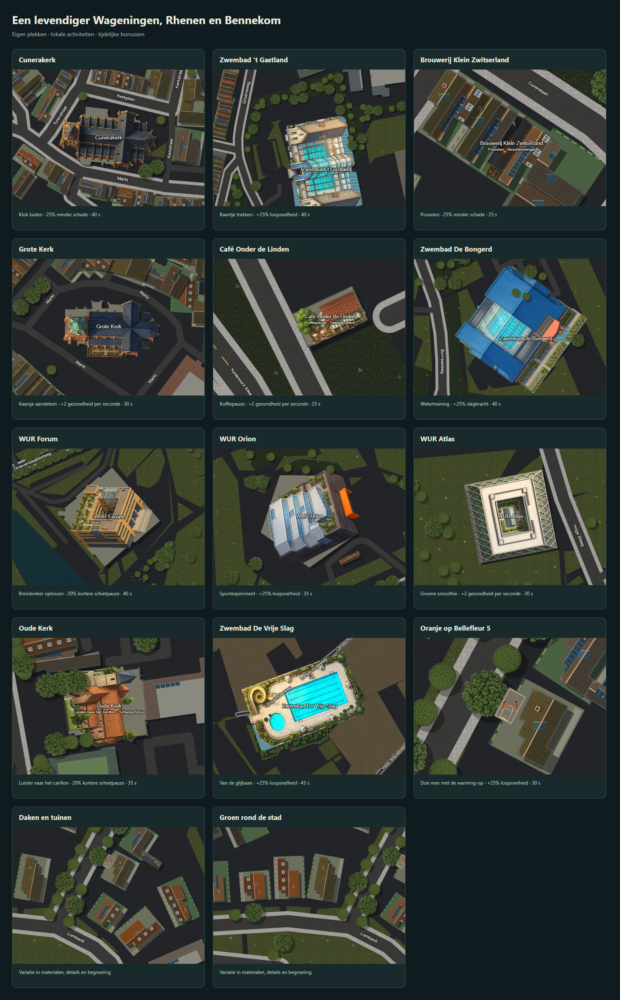

# Bekende plekken en buurtvariatie

Versie 0.3.2 — 15 september 2026.

Tien nieuwe individuele gebouwsprites vullen de bestaande brouwerij aan. De sprites zijn creatieve spelinterpretaties van de locaties. Het Oranje-duo heeft een eigen sprite: twee lange, slanke meisjes met bruin krullend haar, oranje basketbaltenues en witte schoenen.

## Activiteiten

Loop naar de buitenmuur en druk op **E** (controller **B**), of tik op de benoemde interactieknop. Bij de brouwerij geldt het bestaande bereik van tien meter rondom de tap. Een bereikbare auto krijgt voorrang.

| Plek                        | Activiteit                    | Tijdelijk effect                                            | Duur |
| --------------------------- | ----------------------------- | ----------------------------------------------------------- | ---- |
| Brouwerij Klein Zwitserland | Proosten                      | 25% minder schade; het bestaande dronkenschapseffect blijft | 25 s |
| 't Gastland                 | Baantje trekken               | 25% sneller lopen                                           | 40 s |
| Café Onder de Linden        | Koffiepauze                   | 2 gezondheid per seconde herstellen                         | 25 s |
| Cunerakerk                  | Klok luiden                   | 25% minder schade                                           | 40 s |
| Grote Kerk, Wageningen      | Kaarsje aansteken             | 2 gezondheid per seconde herstellen                         | 30 s |
| Oude Kerk, Bennekom         | Luisteren naar het carillon   | 20% kortere schietpauze, afgerond op simulatieticks         | 35 s |
| De Bongerd                  | Watertraining                 | 25% extra schade met vuisten en knuppels                    | 40 s |
| De Vrije Slag               | Van de glijbaan               | 25% sneller lopen                                           | 45 s |
| WUR Forum                   | Breinbreker oplossen          | 20% kortere schietpauze, afgerond op simulatieticks         | 40 s |
| WUR Orion                   | Sportexperiment               | 25% sneller lopen                                           | 35 s |
| WUR Atlas                   | Groene smoothie               | 2 gezondheid per seconde herstellen                         | 30 s |
| Bellefleur 5                | Warming-up met het Oranje-duo | 25% sneller lopen                                           | 30 s |

Activiteiten zijn korte interacties via één druk op de knop. Ze openen geen apart zwem- of puzzelminispel. Eén bonus tegelijk; na afloop volgt vijftien seconden rust. Bonussen verdwijnen bij overlijden. Herstel gaat nooit boven 100 gezondheid. De HUD en het label bij de speler tonen de resterende bonustijd, ook op een gedeeld scherm.

## Plaatsing en uiterlijk

- Bellefleur is de straatnaam op de bestaande Wageningse kaart. Voor het gevraagde “Bellefleurstraat 5” is **Bellefleur 5, Wageningen** gebruikt. PDOK Locatieserver gaf `POINT(5.65951808 51.97490739)` voor het adres. Het veldje ligt 2,8 meter buiten de straatgerichte gevel van de bestaande OSM-voetafdruk, parallel aan Bellefleur. [Adresreferentie](https://www.postcode-adresboek.nl/pand-bellefleur-5-wageningen).
- Zes stabiele varianten verdelen dakmaterialen, dakkapellen, schoorstenen, zonnepanelen en groene daken over gewone gebouwen. Tuinstroken, hagen, plantenbakken en bestrating liggen onder de weglaag. De bestaande wegen en botsingsgeometrie blijven leidend.
- Graspluimen, bloemen, stenen en akkerrijen worden op wereldcoördinaten getekend. De details komen in de bestaande chunkcache; de basketballende figuren worden alleen in beeld getekend. Verminderde beweging zet de balbeweging stil.
- Nieuwe PNG's gebruiken maximaal 384 pixels op de lange zijde en een palet van 128 kleuren. Alle sprites blijven onder de bestaande limiet van 96 KiB per object. De onbewerkte resolutie blijft beschikbaar in `assets/arena/sprites/`.
- SpriteCook-identificaties en SHA-256-voorvoegsels staan in `assets/arena/spritecook-assets.json`; bronvermelding staat in `public/arena/sprites/CREDITS.md`.

## Techniek en controle

De host past bonussen toe in de simulatie. Loopsnelheid gebruikt dezelfde factor in clientvoorspelling. Spelerrijen in snapshots krijgen drie extra getallen: bonussoort, vervaltick en einde van de rustperiode. De ontvanger valideert deze gegevens en accepteert ook de bestaande rij van 19 getallen. Oude clients ondersteunen de uitgebreide rijen niet; herlaad alle deelnemers na een update.

Gecontroleerd:

- Volledige suite op de actuele basisbranch: **1.753 tests geslaagd**, 28 overgeslagen, inclusief controles voor slagkracht, schietpauze, bonusverloop en de basketballocatie.
- Productiebouw en TypeScriptcontrole geslaagd.
- ESLint: nul fouten, twee bestaande waarschuwingen in `EventList.tsx` en `src/types/ical.d.ts`.
- `npm audit --omit=dev`: nul kwetsbaarheden.
- `npm run arena:check-sprites`: alle 48 bestanden aanwezig, binnen budget en voorzien van bronvermelding.
- `node e2e/arena/landmarks.browser.cjs`: veertien kaartuitsneden met de echte renderer en meegeleverde kaartdata, zonder browserfouten. De grote preview meet complete kaartuitsneden; `render-check.json` is geen meting van de framerate tijdens een potje.

De lokale verificatieomgeving gebruikt Node 24.19.0; het projectdoel blijft Node 22.
