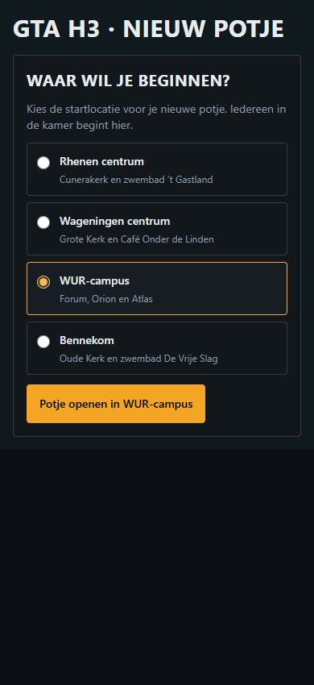
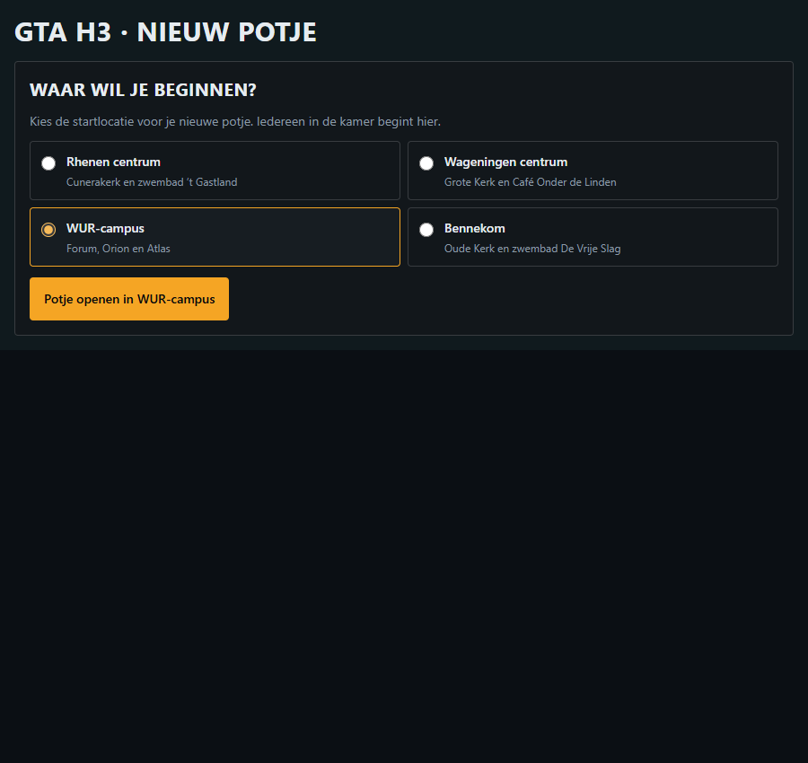

# Startlocatie kiezen

Versie 0.3.3.

Bij **Nieuw potje** verschijnt eerst een keuze uit Rhenen centrum, Wageningen centrum, WUR-campus en Bennekom. Elke locatie heeft herkenningspunten. De knop **Potje openen in …** bevestigt de gekozen plek en maakt pas daarna de kamer aan. De laatste bevestigde locatie wordt op dit apparaat onthouden. Annuleren verandert die voorkeur niet.

Dezelfde keuze staat op de pagina voor tv, controller en eigen spelbeeld. Meedoen via een kamercode blijft een aparte actie; de bestaande kamer bepaalt dan de locatie.

In het spelmenu staat de startlocatie van de gedeelde kamer met uitleg dat die vaststaat. **Verlaten en andere locatie kiezen** verlaat de kamer en opent de keuze voor een nieuw potje. Het verandert de locatie van andere deelnemers niet. De teleportkeuze blijft beschikbaar voor de bestaande lokale oefenmodus.

## Controle

- Launcher: geen kamer vóór bevestiging; gekozen locatie wordt doorgegeven; terugkeren opent de locatiekeuze.
- Alle vier locaties, opgeslagen voorkeur, annuleren en geblokkeerd starten getest.
- Alle vier speelstanden gebruiken de gekozen locatie; meedoen via code blijft apart.
- Browsercontrole van de echte keuze- en menucomponenten met productie-CSS op 900 en 390 pixels: kiezen, starten, terugkeren en onthouden geslaagd; geen horizontale overflow of browserfouten. Dit is een componentcontrole, geen verbinding met een echte multiplayerkamer.
- Productiebouw, TypeScript, lint en beveiligingsscan geslaagd. Twee bestaande lintwaarschuwingen.

