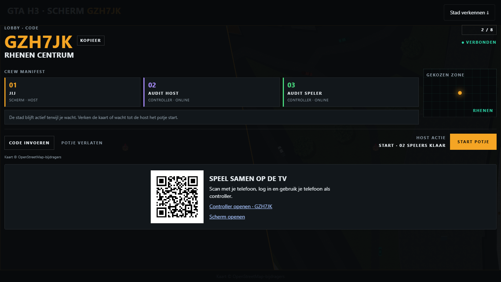
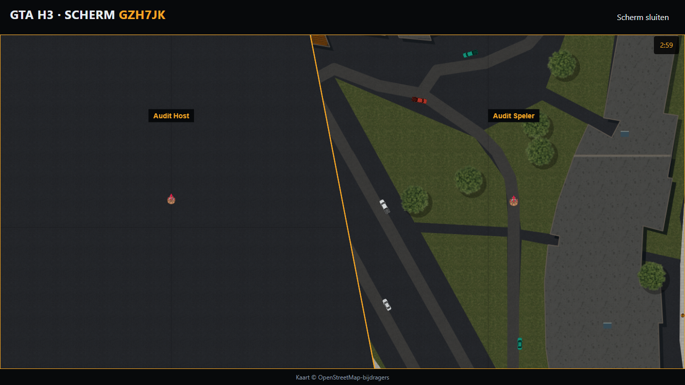
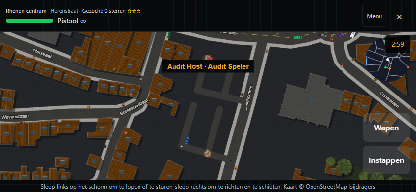

# Slice 2 — uitvoering en verificatie

Datum: 13 september 2026. Versie: **0.3.0**.

Het [implementatieplan](../../../superpowers/plans/2026-09-13-city-arena-slice-2-tv.md)
is uitgevoerd: tv zonder login, accountgebonden telefooncontrollers, hybride spiegelstand,
dynamische camera's voor 1–8 spelers, QR-lobby, Wake Lock, haptiek en standaardgamepads.
De [technische beschrijving](../TV-MODE.md) bevat de API, rollen en migratievolgorde.

## Uitgevoerde controles

| Controle                  | Resultaat                                                                                                                  |
| ------------------------- | -------------------------------------------------------------------------------------------------------------------------- |
| Volledige Vitest-suite    | 1.728 geslaagd; 28 bestaande skips; 246 geslaagde testbestanden en 4 overgeslagen                                          |
| PostgreSQL/API-integratie | 20 geslaagd in 4 bestanden, uitsluitend lokale `gta_h3_test`                                                               |
| Productiebuild            | Geslaagd met Node 22.23.2 / Next 16.3.4, inclusief prebuild en TypeScript                                                  |
| Losse typecheck           | Geslaagd                                                                                                                   |
| ESLint                    | Geen fouten; uitsluitend twee bestaande waarschuwingen in `EventList.tsx` en `types/ical.d.ts`                             |
| Dependency-audit          | 0 kwetsbaarheden                                                                                                           |
| Lockfile                  | Installatie met dezelfde `--legacy-peer-deps`-optie als CI; bestaande dependencies behouden, releaseversie bijgewerkt      |
| Opmaak / diff             | Gewijzigde bronbestanden gecontroleerd met Prettier; geen conflictmarkers of whitespacefouten; controle op sleutelpatronen |
| Documentatie              | Routes opnieuw gegenereerd; API, migratie en reproduceerbare browsertests beschreven                                       |

De build meldt bestaande deprecaties voor de Sentry-configimport en middlewarebestandsnaam.
Een eerste Windows-build stuitte op een tijdelijke bestandsblokkade van `next-env.d.ts`;
de volgende builds slaagden. De laatste build en de browserproeven gebruiken de uiteindelijke
applicatiecode. Browserproeven zijn uitgevoerd tegen `next start`, niet alleen tegen de devserver.

## Browserbewijs

Chrome headless met echte Ably-verbindingen en twee ingelogde, lokale testaccounts:

- Scherm zonder login maakt kamer en QR-code; twee telefoons sluiten aan in portrait en landscape.
- Spel start, telt af, toont de timer en verwerkt controllerbeweging in de hostsnapshots.
- Canvaspixels tonen daadwerkelijk de stad; screenshots zijn visueel bekeken.
- Beide controllertelefoons hebben geen canvas en doen **nul kaart-/spriteverzoeken**.
- Een tweede scherm observeert de bestaande host. Na sluiten van de host neemt het over;
  speler-ID's blijven gelijk en de simulatieticks lopen door.
- Hybride stand: de server registreert daadwerkelijk `hybrid`; het canvas tekent de namen
  van beide gevolgde spelers en toont de gedeelde camera met touchbediening.
- Een gesimuleerde standaardgamepad beweegt de eigen speler; ontkoppeling stopt de beweging.
- Geen browserexceptions in de gecontroleerde schermen en controllers.

Machineleesbare resultaten: [tv/controller](browser.json), [hybride/gamepad](hybrid.json).
Uitvoer: [productie-browserproeven](browser-production.txt), [hybride detailcontrole](hybrid-production.txt).

| Lobby                     | Tv tijdens spel                        |
| ------------------------- | -------------------------------------- |
|  |  |

| Hostovername                                 | Hybride spiegelbeeld                      |
| -------------------------------------------- | ----------------------------------------- |
|  |  |

[Controller portrait](controller-portrait.png) · [Controller landscape](controller-landscape.png).

## Gerichte regressies

Tests dekken capaciteit acht plus twee, gelijktijdig aansluiten, eigendom van schermcookies,
cross-originverzoeken, rate limits, exacte Ably-rechten, verlopen leden en uitslagen met alleen
echte spelers. Schermruntime-tests bewaren posities, gezondheid, score en historie bij overname
en negeren de oude epoch. Cameratests dekken 1–8 groepen, diagonalen, hysterese, herenigen,
resize, reduced motion en de echte browser-DOMRect. Budgettests voorkomen dat volgende
cameravakken alsnog rasterwerk uitvoeren als het framebudget op is. Wake Lock-tests dekken
herstel, weigering en een late aanvraag die na vertrek alsnog wordt toegewezen.

Bij de visuele controle is een DOMRect-fout gevonden en opgelost: het veld had geldige
speldata maar ongeldige camera-afmetingen. De browsertest controleert daarom nu ook
canvaspixels. De hybride proef wacht op de ingelogde UI voordat hij een stand kiest en
controleert zowel de serverrol als daadwerkelijk getekende spelerslabels.

## Reproduceren en grenzen

Volg [de lokale instructies](../../../../e2e/arena/README.md) en voer `npm run test:arena:tv` uit.
De testserver blijft op loopbackpoort 3100; de testconfiguratie wijzigt geen omgevingsbestanden.
De schemawijziging is met de bijgeleverde migratie op de geïsoleerde database toegepast.

De PR staat op een afzonderlijke branch vanaf de gemergede arena-audit op `image`.
Build, typecheck, lint, volledige tests, database/API-integratie en dependency-audit zijn
op die basis opnieuw geslaagd. `qrcode.react` was inmiddels onderdeel van die basis;
de lockfile wijzigt daardoor uitsluitend de releaseversie. `.cache/**` is uitgesloten van
Vitest omdat daar een tweede checkout staat.

Er is geen productiedeploy of productiemigratie uitgevoerd. Fysieke casting, smart-tv-browsers,
echte gamepads, iOS-vibratie en langdurige batterij-/warmtebelasting zijn geen onderdeel van
de geautomatiseerde browseruitslag en zijn niet als getest aangemerkt.
